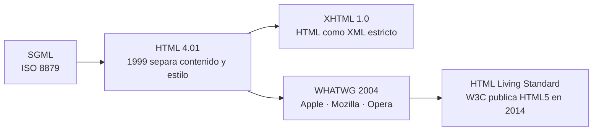
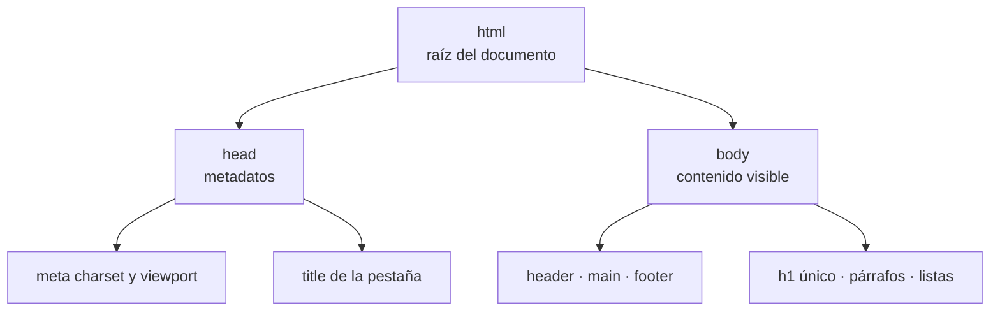

# HTML5

## Unidad 1 · Introducción a HTML5

**Módulos 0373 (LMH) · 0488 (DI)**

Lenguajes de marcas y sistemas de gestión de información (DAW) · Desarrollo de Interfaces (DAM)

Curso 2026/2027

Note:
Primera unidad del bloque de HTML5: de dónde viene el lenguaje, cómo se organiza un documento y qué reglas siguen las etiquetas. Es la base de todo lo demás: sin código bien formado no hay semántica, ni formularios, ni accesibilidad. Memorizad la plantilla del head, porque la usaréis en todos los ejercicios del curso. Pregunta para abrir: ¿alguien sabe por qué la primera línea de cualquier HTML es `<!DOCTYPE html>`?

---

## Objetivos de aprendizaje

<span class="fragment">1. Explicar el papel de <mark>HTML5</mark> frente a <mark>CSS</mark> y JavaScript</span>

<span class="fragment">2. Reconstruir la evolución desde SGML hasta el <mark>HTML Living Standard</mark></span>

<span class="fragment">3. Escribir un documento bien formado: plantilla, elementos, atributos y anidamiento</span>

<span class="fragment">4. Aplicar entidades de caracteres y validar el código con el <mark>validador del W3C</mark></span>

Note:
Cuatro objetivos y los cuatro son prácticos: al terminar tenéis que ser capaces de escribir una página completa que pase el validador sin errores. El segundo parece histórico, pero se pregunta en examen: saber de dónde viene explica por qué HTML es tolerante con los errores. El cuarto es el hábito profesional: validar antes de entregar, siempre.

---

## Conocimientos previos

<div style="font-size: 1em; text-align: left;">

Antes de arrancar, tres cosas que debéis dominar:
</div>

<span class="fragment">Usar <strong>VS Code</strong> y guardar los archivos con la extensión <code>.html</code></span>

<span class="fragment">Mover rutas relativas dentro de una carpeta: <code>./</code> y <code>../</code></span>

<span class="fragment">Idea general de qué hace un navegador al abrir una URL</span>

<span class="fragment">Practicar con los <strong>10 ejercicios</strong> del capítulo 9 y sus soluciones</span>

Note:
Si domináis los tres primeros puntos vais sobrado; el resto se afina en la primera sesión. Recordad el recorrido: el navegador pide el archivo, lo analiza, construye el árbol DOM y lo pinta; esa imagen mental explica casi todos los errores de esta unidad. Pregunta al grupo: ¿qué diferencia hay entre lo que escribe el navegador en la barra de direcciones y lo que veis en pantalla?

---

## HTML en el stack: estructura, no apariencia

<div style="font-size: 1em; text-align: left;">

<em>HyperText Markup Language</em> describe la <strong>estructura</strong> y el <strong>contenido</strong>: dice qué es cada cosa, no cómo se ve.
</div>

<span class="fragment">HTML son los cimientos y las paredes de la página</span>

<span class="fragment">CSS es la pintura; JavaScript, la instalación eléctrica</span>

<span class="fragment"><strong>HTML no programa</strong>: no hay variables, ni bucles, ni condicionales</span>

<span class="fragment">Lo que debe <em>ocurrir</em> va en JavaScript; lo que debe <em>lucir</em>, en CSS</span>

Note:
Esta diapositiva es el concepto que sostiene la unidad entera: HTML declara significado y nada más. Si escribís etiquetas pensando en el tamaño de la fuente, estáis mezclando capas y os será imposible reutilizar el contenido. Preguntad siempre: ¿esto dice qué es o dice cómo se ve? La respuesta ya os dice en qué fichero va.

--

## HTML en el stack: estructura, no apariencia
<div class="fragment">

</div>


---

## Del SGML a HTML5



<span class="fragment">Hoy ya no hay «versiones»: rige un único <mark>&lt;!DOCTYPE html&gt;</mark> de primera línea</span>

<span class="fragment">Esa declaración activa el modo estándar y evita el <em>quirks mode</em> de los navegadores de los 90</span>

Note:
De SGML heredamos las etiquetas de apertura y cierre; de la separación de HTML 4.01, el anidamiento estricto. XHTML intentó ser XML puro y fracasó porque la web real no era tan limpia; de ahí que el WHATWG asumiera el mantenimiento. Fijaos en el detalle: `<!DOCTYPE html>` no es una etiqueta, es una declaración; no cierra nada.

--

## HTML vs XHTML: Parsers y reglas

| Característica | HTML5 | XHTML 1.0 / 1.1 |
|---|---|---|
| **Sintaxis base** | HTML Living Standard (flexible) | XML estricto (W3C) |
| **Tipo MIME** | `text/html` | `application/xhtml+xml` |
| **Tratamiento errores** | Recuperación determinista de errores | Error fatal (*Yellow Screen of Death*) |
| **Reglas clave** | Cierre implícito tolerado | Cierre obligatorio (`<br />`), minúsculas y comillas |

<span class="fragment"><strong>Bien formado</strong>: cumple la sintaxis XML · <strong>Válido</strong>: cumple además su DTD o esquema</span>

<span class="fragment">En HTML5 moderno prima la <mark>robustez y el parser estándar</mark> sobre la rigidez de XML</span>

Note:
Concepto clave curricular: la diferencia entre documento bien formado (well-formed: sintaxis correcta, etiquetas anidadas y cerradas, atributos entrecomillados) y documento válido (valid: respeta la DTD/esquema). XHTML utilizaba parsers XML estrictos que bloqueaban la renderización ante el más mínimo error. HTML5 definió un algoritmo de parseo determinista que normaliza cualquier error en el DOM.

---

## Qué aporta HTML5

<span class="fragment"><mark>Semántica</mark>: header, nav, main, section, article y footer describen el papel del contenido</span>

<span class="fragment">Formularios: tipos email, number y date con validación nativa (required, pattern)</span>

<span class="fragment">Multimedia nativo: video, audio y canvas, sin plugins como Flash</span>

<span class="fragment">APIs: geolocalización, localStorage, drag &amp; drop y fetch</span>

<span class="fragment">Accesibilidad y SEO: el significado lo entienden lectores de pantalla y buscadores</span>

Note:
Lo verdaderamente nuevo de HTML5 no es la sintaxis, que sigue siendo la de siempre, sino la semántica y las APIs. La semántica es lo que convierte un montón de div en un documento comprensible para una máquina. Pregunta: si buscáis «recetas» en Google, ¿cómo adivina qué es el título y qué es el texto?

---

## Mito: «HTML5 = web moderna»

<div style="font-size: 1em; text-align: left;">

<strong>HTML5 no es un framework: es solo el estándar de marcado.</strong>
</div>

<span class="fragment">Se cita para vender cursos con CSS3, JavaScript ES6 o APIs, pero eso es complemento</span>

<span class="fragment">Tampoco existe <strong>CSS3</strong> como especificación separada: CSS crece por módulos</span>

<span class="fragment">HTML <strong>no es lenguaje de programación</strong>, sino lenguaje de marcado</span>

<span class="fragment">En una frase: define etiquetas, atributos y estructura; estilo y comportamiento van aparte</span>

Note:
Este es el error conceptual más extendido fuera del aula y se pregunta en casi todos los exámenes teóricos. «HTML5 y CSS3» es etiqueta de marketing: HTML5 es un estándar y CSS es una colección de módulos que se publican por separado. Si en un folleto pone «curso de HTML5», preguntad qué quieren decir realmente.

---

## Plantilla del documento

```html
<!DOCTYPE html> <!-- Declaración: no es una etiqueta -->
<html lang="es"> <!-- Raíz; lang = idioma del contenido -->
  <head>
    <meta charset="UTF-8"> <!-- Codificación: ñ, tildes y € -->
    <meta name="viewport" content="width=device-width, initial-scale=1.0">
    <title>Blog · Desarrollo web</title> <!-- Título de la pestaña -->
    <link rel="stylesheet" href="css/estilos.css"> <!-- CSS externo -->
  </head>
  <body>
    <main><h1>Mi blog</h1><p>Primer artículo.</p></main> <!-- aquí empieza lo visible -->
  </body>
</html>
```

<span class="fragment">Trío del head: <strong>charset</strong> · <strong>viewport</strong> · <strong>title</strong></span>

Note:
Este esqueleto se memoriza y se usa en todos los ejercicios: diez líneas que resuelven el 80 % de los problemas del primer día. `charset` debe aparecer dentro de los primeros 1024 bytes y `viewport` es obligatorio en responsivo, o los móviles renderizarán a 980 px. Fijaos en que el body solo contiene contenido visible: los metadatos no van ahí.

--

## Metadatos y enlaces avanzados en &lt;head&gt;

```html
<!-- Resource Hints: acelerar la carga de recursos clave -->
<link rel="preconnect" href="https://fonts.googleapis.com">
<link rel="preload" href="/fonts/inter.woff2" as="font" type="font/woff2" crossorigin>

<!-- PWA y visualización en dispositivos -->
<meta name="theme-color" content="#1e40af">
<link rel="manifest" href="/manifest.json">
<link rel="apple-touch-icon" href="/icon-192.png">

<!-- Sindicación de contenidos (RSS / Atom) -->
<link rel="alternate" type="application/rss+xml" title="Feed RSS" href="/rss.xml">

<!-- Datos estructurados (SEO Semántico con Schema.org) -->
<script type="application/ld+json">
{
  "@context": "https://schema.org",
  "@type": "Course",
  "name": "Lenguajes de Marcas",
  "description": "Módulo formativo 0373 (DAW/DAM)"
}
</script>
```

<span class="fragment">Resource Hints (<mark>preload, preconnect</mark>) optimizan el rendimiento de carga</span>

<span class="fragment">JSON-LD proporciona datos semánticos que procesan los motores de búsqueda</span>

Note:
En el head moderno no solo van títulos y estilos. Resource Hints como preload priorizan fuentes o imágenes críticas; theme-color y manifest.json configuran la experiencia PWA e interfaz en navegadores móviles; y JSON-LD (Schema.org) aporta datos estructurados de alta relevancia SEO. La sindicación RSS permite a agregadores suscribirse automáticamente mediante el link rel="alternate".

---

## Elemento, etiqueta y elementos vacíos

<div style="font-size: 1em; text-align: left;">

La <strong>etiqueta</strong> es el texto entre ángulos; el <strong>elemento</strong> une apertura, contenido y cierre; el <strong>atributo</strong> va solo en la apertura.
</div>

```html
  <!-- recurso: imagen -->
<br>                                                 <!-- salto literal -->
<hr>                                                 <!-- cambio de tema -->
<input type="email" name="correo">                   <!-- campo -->
<meta charset="UTF-8">
<link rel="stylesheet" href="estilos.css">
```

<span class="fragment">Un elemento <strong>vacío</strong> no tiene contenido ni cierre: representa una acción o un recurso</span>

<span class="fragment">HTML5 admite el estilo XHTML <code>&lt;img /&gt;</code>, pero la convención es no escribir la barra</span>

Note:
Los elementos vacíos se reconocen porque expresan «haz esto» en lugar de «envuelve esto». Escribir la barra final es válido pero anticuado: las guías de estilo modernas (MDN, W3C) la omiten. Si dais una etiqueta de cierre a un `img`, el validador os marcará error de seguido.

---

## Atributos y booleanos

<div style="font-size: 1em; text-align: left;">

Van en la <strong>etiqueta de apertura</strong> con formato <code>nombre="valor"</code>, en minúsculas y sin repetirse en la misma etiqueta.
</div>

```html
<a href="matricula.html" title="Inscripción">Matricularme</a>

<input type="text" name="apellido" required>   <!-- booleano -->
<input type="text" name="dni" disabled>        <!-- booleano -->
<input type="checkbox" name="acepto" checked>  <!-- booleano -->
```

<span class="fragment">Los <mark>atributos booleanos</mark> no llevan valor: su presencia ya activa la propiedad</span>

<span class="fragment">Habituales: disabled, required, checked, selected, readonly, autofocus</span>

<span class="fragment"><strong>id</strong> es único en la página; <strong>class</strong> se repite sin límite</span>

Note:
Es la trampa clásica del examen: `required="true"` y `checked="false"` son incorrectos, y lo peor es que el segundo sigue funcionando al revés, porque el atributo existe. Los booleanos se escriben solos, tal cual. El `id` es el DNI del elemento y es lo que enlazan `label`, CSS y JavaScript; si se repite, todo lo demás falla.

---

## Anidamiento correcto

```html
<!-- CORRECTO: cierres en orden inverso -->
<article>
  <h2>Noticias del ciclo</h2>
  <p>Estudiaremos <strong>HTML semántico</strong> esta semana.</p>
</article>

<!-- INCORRECTO: cierres cruzados -->
<article>
  <p>Estudiaremos <strong>HTML semántico.</p>
</strong>
```

<span class="fragment">Regla de oro: <mark>lo que se abre de último, se cierra de primero</mark></span>

<span class="fragment">El navegador lo «arregla», pero el árbol resultante no es el que diseñaste</span>

<span class="fragment">Bloques dentro de un párrafo (p, ul, h2) los expulsa solo: no es lo que esperabais</span>

Note:
HTML es jerárquico: los elementos forman un árbol y los cierres van en orden inverso. La tolerancia de los navegadores es una trampa: el segundo ejemplo se ve idéntico en pantalla, pero el DOM real es otro y CSS, JavaScript y lectores de pantalla trabajan con esa estructura oculta. Por eso se valida: el ojo humano no detecta cierres cruzados.

---

## Diagrama · el árbol del documento



<span class="fragment">Todo lo que escribáis acaba como <strong>nodos</strong> de este árbol: ese es el DOM real</span>

Note:
`html` es la raíz, `head` guarda información *sobre* la página y `body` información *de* la página. Este dibujo es exactamente lo que muestra la pestaña Elements con F12. Cuando un estilo no os haga caso, bajad a comprobar dónde ha colocado el navegador el nodo: casi siempre el problema está en el árbol, no en CSS.

---

## Bloque y línea no es display

<span class="fragment"><strong>Bloque</strong>: p, h1-h6, div, ul, li, section → todo el ancho, en línea nueva</span>

<span class="fragment"><strong>Línea</strong>: a, strong, em, span, img, code → viajan dentro del texto</span>

<span class="fragment">Es la <strong>semántica de partida</strong> del elemento, no una propiedad CSS</span>

<span class="fragment">Con <code>display: block</code> conviertes un span en bloque: por eso no son lo mismo</span>

<span class="fragment">HTML no distingue mayúsculas, pero se escribe en <strong>minúsculas</strong> por convención</span>

Note:
La pregunta de examen es literal: «¿bloque y línea es lo mismo que display?». La respuesta es no, porque una es el comportamiento heredado de la etiqueta y la otra es una propiedad que podéis cambiar cuando queráis. Ojo con dos excepciones: `img` es de línea pero no es texto, y `li` es de bloque aunque viva dentro de un menú.

---

## Entidades y codificación

| Se muestra | Entidad |
|---|---|
| `<` | `&lt;` |
| `>` | `&gt;` |
| `&` | `&amp;` |

```html
<p>Escribe <code>&lt;link rel="stylesheet"&gt;</code> para enlazar CSS.</p>
<p>Aprende HTML y CSS &amp; JavaScript. &copy; 2026</p>
```

<span class="fragment">Con <code>charset="UTF-8"</code> los acentos y la ñ van <strong>directos</strong>, sin ninguna entidad</span>

Note:
El navegador interpreta `<`, `>` y `&` como parte del lenguaje, así que para mostrarlos como texto hacen falta entidades. En UTF-8 no necesitáis `&aacute;` ni `&ntilde;`: escribid «matrícula» tal cual, aunque `&copy;` para © sigue siendo cómoda. Usad `&nbsp;` solo para impedir un salto de línea concreto; para empujar el diseño eso lo resuelve CSS con márgenes y rellenos. Si dejáis un `&` suelto en el texto, el validador os avisará.

---

## Validación y herramientas de desarrollo

<span class="fragment">Que el código «funcione» no significa que sea <strong>correcto</strong></span>

<span class="fragment"><strong>validator.w3.org</strong>: pegar el código, indicar la URL o subir el archivo</span>

<span class="fragment">Errores típicos: etiqueta sin cerrar, <code>lang</code> ausente, <code>id</code> duplicado</span>

<span class="fragment"><strong>F12 → Elements</strong>: el árbol DOM real que construyó el navegador</span>

<span class="fragment">Si un estilo no te hace caso, comprueba si el nodo existe antes de culpar a CSS</span>

Note:
El validador distingue errores de avisos: los errores hay que corregirlos todos, los avisos se valoran. La pestaña Elements os enseña la verdad del documento, que casi nunca coincide con lo que creíais haber escrito. Estas dos herramientas son las que usaréis en cada entrega, no solo en clase.

---

## Ejemplo: página mínima bien formada

```html
<!DOCTYPE html> <!-- 1. Declaración HTML5 -->
<html lang="es"> <!-- 2. Raíz e idioma -->
<head>
  <meta charset="UTF-8"> <!-- 3. ñ, tildes y € -->
  <meta name="viewport" content="width=device-width, initial-scale=1.0">
  <title>Matrícula DAW · 2026-2027</title> <!-- 4. Pestaña -->
</head>
<body>
  <header><h1>Matrícula · DAW</h1></header> <!-- único h1 -->
  <main><label for="nombre">Nombre:</label><input id="nombre" name="nombre" required></main>
</body>
</html>
```

<span class="fragment">Comprueba: DOCTYPE en la primera línea · lang y charset en el head · un solo h1</span>

<span class="fragment">Valida en <code>validator.w3.org</code> y corrijo hasta que no dé ningún error</span>

Note:
Es la página mínima que se considera bien formada y sirve de base para cualquier práctica. Fijaos en el `for` del label: coincide con el `id` del campo, y por eso al pulsar sobre el texto se activa el input. El `required` y el `type` correcto ya os dan validación nativa sin escribir una línea de JavaScript.

---

## Error común: lang y charset ausentes

⚠ <span class="fragment">Sin <code>lang="es"</code> el lector anuncia «añadir» en inglés</span>

⚠ <span class="fragment"><code>charset</code> al final o en ISO-8859-1: verás <code>ñ</code></span>

⚠ <span class="fragment">Mayúsculas y cierres cruzados: rompen convención y árbol</span>

⚠ <span class="fragment">Bloques (p, ul, h2) dentro de un párrafo: los expulsa</span>

Note:
Los dos primeros son los más frecuentes de todo el curso y se detectan en dos segundos: mirad la página y si veis `ñ`, es de codificación. El tercero es la marca de quien escribe HTML sin conocer la convención o deja cierres cruzados que el navegador repara por su cuenta. El último es invisible en pantalla y solo lo revela el validador.

---

## Autoevaluación: atributos booleanos

Un compañero escribe:

```html
<input type="text" name="dni" required="true">
<input type="checkbox" name="acepto" checked="false">
```

<span class="fragment">¿Es correcto? Pista: ¿qué activa realmente un atributo booleano?</span>

<span class="fragment"><strong>No, en los dos casos.</strong> Los booleanos no llevan valor: basta con que aparezcan</span>

<span class="fragment">La casilla con <code>checked="false"</code> seguiría <strong>marcada</strong>: el atributo existe</span>

Note:
Pregunta de examen clásica y se responde mal por desconocimiento del concepto, no por falta de práctica. El truco es recordar que un booleano en HTML funciona como un interruptor: o está o no está, no hay posición intermedia. Si queréis desactivar algo, se quita el atributo con JavaScript o se usa una clase de CSS.

---

## Claves para el examen

- `<!DOCTYPE html>` **no es etiqueta**: activa el modo estándar

- Trío del head: **charset, viewport, title**; sin `lang` se acentúa mal

- HTML5 es solo el estándar; **no existe CSS3** separado

- Los booleanos (`disabled`, `required`) **no llevan valor**

- Anidamiento: **lo que se abre de último, se cierra de primero**

- Entidades solo para `<`, `>` y `&`; en UTF-8 van directos

Note:
Seis claves y todas salen del mismo sitio: del código bien formado y de la separación de capas. Si sólo recordáis una, que sea la del DOCTYPE y el trío del head, porque aparecen en todos los ejercicios. Repasad también los booleanos y el orden de cierre: son las preguntas cortas que más se fallan y que más puntos regalan.
