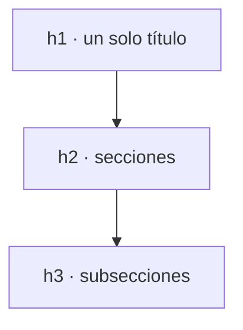

# HTML5

## Unidad 2 · Texto y semántica de contenido

**Módulos 0373 (LMH) · 0488 (DI)**

Lenguajes de marcas y sistemas de gestión de información (DAW) · Desarrollo de Interfaces (DAM)

Curso 2026/2027

Note:
Segunda unidad: una página «bonita» con texto plano sigue sin significado, así que aquí damos jerarquía al contenido y marcamos la función de cada fragmento de texto. Veremos encabezados, párrafos, listas, elementos en línea semánticos y agrupaciones. Es el temario que más se repite en los ejercicios de accesibilidad y el que mejor se aprende practicando. Pregunta para empezar: ¿cómo adivina un lector de pantalla cuál es el título principal de una web?

---

## Objetivos de aprendizaje

<span class="fragment">1. Construir la <mark>jerarquía de encabezados</mark> h1-h6 sin saltos de nivel</span>

<span class="fragment">2. Elegir entre párrafos, listas y <mark>separadores</mark> según el tipo de contenido</span>

<span class="fragment">3. Aplicar elementos en línea <mark>semánticos</mark>: strong, em, mark, time, del, ins</span>

<span class="fragment">4. Extraer el <mark>esquema</mark> de una página y revisarlo en diez segundos</span>

Note:
El objetivo práctico es el cuarto: con la lista de encabezados se decide en diez segundos si una maquetación es comprensible. El tercero es el que más se olvida en clase, porque tendemos a usar `<strong>` porque «queda en negrita» y no porque algo sea importante. Sed meticulosos con los niveles: es la mitad del examen práctico.

---

## Motivación: texto con significado

<div style="font-size: 1em; text-align: left;">

El marcado semántico es lo que separa un documento de un bloc de notas con formato.
</div>

<span class="fragment">Da <strong>jerarquía</strong>: qué es el título, qué es una sección, qué es un pie</span>

<span class="fragment">Da <strong>estructura</strong>: bloques de contenido que se pueden reutilizar</span>

<span class="fragment">Da <strong>función</strong>: esto es una advertencia, esto es una fecha, esto es una cita</span>

<span class="fragment">Se gana en <strong>accesibilidad</strong>, <strong>SEO</strong> y mantenimiento</span>

Note:
Conocimientos previos de la unidad 1: documento básico montado, `head`, `body`, `lang` y `charset`, y distinguir elementos de bloque de elementos de línea. Todo lo de hoy se aplica sobre esa base, así que si os atascáis con alguna etiqueta, volved al esqueleto de la primera unidad. Fijaos en la palabra clave: función. No elegimos etiquetas por su aspecto, sino por lo que el texto representa dentro del documento.

---

## Encabezados: orden, no tamaño

```html
<!-- CORRECTO: un h1 y niveles encadenados -->
<h1>Horario de 1.º DAW · 2.º trimestre</h1>
<h2>Lunes</h2>
<h3>Mañana</h3>
<p>Programación, de 8:00 a 10:00.</p>

<!-- INCORRECTO: dos h1 y salto de h2 a h4 -->
<h1>Horario</h1>
<h1>Lunes</h1>
<h4>Programación</h4>
```

<span class="fragment">Dos reglas: <mark>un solo h1 por página</mark> y sin saltos de nivel</span>

<span class="fragment">No se eligen por el tamaño que queráis dar: eso lo decide CSS</span>

<span class="fragment">El texto debe resumir lo que viene después («Tipos de listas», no «Otra cosa»)</span>

Note:
Los encabezados se ordenan por posición jerárquica, no por tamaño visual: `h5` y `h6` casi no se usan y el tamaño lo pone CSS con `font-size`. Un esquema con saltos es inutilizable para quien navega por índice. El segundo ejemplo es el que aparece en los exámenes: dos h1 y un salto de h2 a h4.

---

## Árbol de encabezados



<span class="fragment">Buscadores y lectores usan este árbol como índice</span>

Note:
Este árbol es lo que buscador y lector de pantalla montan a partir de vuestra página. Si el árbol está roto, el índice también, y saltar de un bloque a otro se vuelve imposible. En Interfaces, la primera revisión de cualquier maquetación es extraer este esquema antes de mirar un solo color.

---

## Lectores de pantalla, SEO y WCAG

<span class="fragment"><strong>Lectores de pantalla</strong>: permiten saltar de bloque en bloque sin leerlo todo</span>

<span class="fragment"><strong>Buscadores</strong>: usan los niveles para entender estructura y peso de cada sección</span>

<span class="fragment"><strong>WCAG 2.1 · criterio 1.3.1</strong> (nivel A): información y relaciones</span>

<span class="fragment">«La estructura y las relaciones pueden determinarse por software o están como texto»</span>

<span class="fragment">Un esquema roto no es un fallo estético: es <strong>inaccesibilidad</strong></span>

Note:
El criterio 1.3.1 es de nivel A, el más exigente: si no se cumple, la página no es accesible en absoluto. Significa que relaciones como «este título pertenece a esta sección» deben estar en el marcado, no solo en el tamaño de la fuente. Pregunta al grupo: si los encabezados se ponen todos del mismo tamaño con CSS, ¿sigue funcionando el índice? Sí, y esa es la prueba definitiva de que la estructura está bien escrita.

---

## Párrafos, br y hr

```html
<p>La matrícula abre el 1 de junio y cierra el 30 de septiembre.</p>

<!-- br: el salto forma parte del texto -->
<p>Instituto Cervantes<br>Calle Mayor, 12<br>28013 Madrid</p>

<!-- hr: cambio de tema, no decoración -->
<p>Este es el resumen del curso anterior.</p>
<hr>
<h2>Nuevo curso disponible</h2>
```

<span class="fragment">Cada <code>&lt;p&gt;</code> es <strong>una idea</strong> y no admite bloques en su interior</span>

<span class="fragment"><code>&lt;br&gt;</code> solo cuando el salto forma parte del texto (direcciones, versos)</span>

<span class="fragment"><code>&lt;hr&gt;</code> marca un <strong>cambio de tema</strong>, no es una línea decorativa</span>

Note:
La tentación de usar `<br>` para «bajar una línea» es el error de maquetación más antiguo de HTML: eso es trabajo de CSS con márgenes. Igual con `<hr>`: si queréis una línea decorativa, va en CSS. Dentro de un párrafo no pueden entrar listas ni títulos: el navegador los expulsa y el resultado no es el que esperabais.

---

## Listas: ul, ol y dl

```html
<!-- ol: start y reversed cambian la numeración -->
<ol start="4" reversed>
    <li>Revisar el enunciado</li>
    <li>Maquetar con HTML semántico</li>
    <li>Validar en el W3C</li>
</ol>

<!-- ul: el orden no importa -->
<ul><li>Accesibilidad</li><li>Rendimiento</li></ul>

<!-- dl: término y descripción -->
<dl><dt>HTML</dt><dd>Estructura y contenido.</dd></dl>
```

<span class="fragment">Hijos directos siempre <mark>&lt;li&gt;</mark>: meter otro elemento es HTML inválido</span>

<span class="fragment"><code>&lt;ul&gt;</code> sin orden · <code>&lt;ol&gt;</code> con orden (<code>start</code>, <code>reversed</code>)</span>

<span class="fragment">Anidamiento dentro del <code>&lt;li&gt;</code>, nunca dentro de la <code>&lt;ul&gt;</code> madre</span>

<span class="fragment"><code>&lt;dl&gt;</code> para glosarios: <code>&lt;dt&gt;</code> término, <code>&lt;dd&gt;</code> su descripción</span>

Note:
La pregunta de partida es siempre la misma: ¿el orden importa? Si la respuesta es sí, es `ol`; si no, es `ul`. Con `start="4" y reversed` la lista arrancaría en 4 y terminaría en 2. Los menús de navegación son listas de enlaces, no tablas: `<nav> + <ul> + <li> + <a>`.

--

## Listas: ul, ol y dl

<span class="fragment"><code>&lt;dl&gt;</code> "definition list": <code>&lt;dt&gt;</code> "definition term" <code>&lt;dd&gt;</code> "description details"</span>

```html
  <p>Cryptids of Cornwall:</p>
  <dl>
    <dt>Beast of Bodmin</dt>
    <dd>A large feline inhabiting Bodmin Moor.</dd>

    <dt>Morgawr</dt>
    <dd>A sea serpent.</dd>

    <dt>Owlman</dt>
    <dd>A giant owl-like creature.</dd>
</dl>
```
---

## strong, em y mark: significado, no apariencia

| Elemento | Cuándo se usa y ejemplo |
|---|---|
| `strong` | Importancia real: **Alerta**, plazo cerrado |
| `em` | Énfasis en la pronunciación: *fundamental* |
| `mark` | Resaltar por relevancia: Pendiente |

<span class="fragment">Los tres son <mark>semánticos</mark>: el lector los anuncia como tales</span>

<span class="fragment">La negrita visual es CSS; en línea van también `del`/`ins` y `time`</span>

Note:
`strong` marca importancia objetiva (una advertencia crítica) y `em` énfasis en la pronunciación; ninguno de los dos se elige porque «se ve mejor». Si solo queréis apariencia, usad un span con clase y estiladlo con CSS. La fecha correcta es `<time datetime="2026-06-15">15 de junio</time>`, legible para las máquinas.

--

## Semántica en línea: time, del/ins y citas

<span class="fragment"><code>&lt;time datetime="2026-10-08T18:00"&gt;</code>: máquina lee fecha exacta en <strong>ISO 8601</strong></span>

<span class="fragment"><code>&lt;del&gt;</code> (texto eliminado/precio tachado) vs <code>&lt;ins&gt;</code> (texto añadido/precio oferta)</span>

<span class="fragment"><code>&lt;q&gt;</code>: cita breve en línea (el navegador añade comillas automáticas según el <code>lang</code>)</span>

<span class="fragment"><code>&lt;blockquote&gt;</code>: cita extensa en bloque independiente</span>

<span class="fragment"><code>&lt;cite&gt;</code> (etiqueta: título de obra) vs <code>cite="..."</code> (atributo: URL fuente invisible)</span>

Note:
Detalles clave para el alumnado:
1. time permite a navegadores y teléfonos añadir eventos al calendario directamente gracias a datetime.
2. del e ins son esenciales en comercio electrónico (rebajas: del 50€ ins 29€) y control editorial de cambios.
3. El atributo cite de blockquote no es clicable ni visible (es metadato para buscadores); si se quiere enlace visible, se añade dentro un enlace <a>.
4. La etiqueta <cite> jamás debe contener el nombre de la persona autora, sino el título de la obra (libro, canción, película, especificación).

---

## Código técnico: code, pre, kbd, samp

<span class="fragment"><code>&lt;code&gt;</code>: texto de programación <strong>en línea</strong></span>

<span class="fragment"><code>&lt;pre&gt;</code>: bloque con espaciado y saltos <strong>preservados</strong>, envuelve siempre a <code>code</code></span>

<span class="fragment"><code>&lt;kbd&gt;</code>: la tecla que teclea la persona (<kbd>Ctrl</kbd> + <kbd>S</kbd> para guardar)</span>

<span class="fragment"><code>&lt;samp&gt;</code>: salida de muestra: <samp>Validación superada</samp></span>

<span class="fragment"><code>&lt;var&gt;</code>: variable, p. ej. si <var>n</var> es 0 el bucle no se ejecuta</span>

Note:
Estos cinco elementos son el equivalente semántico de la fuente monoespaciada: no pintan, declaran. `pre` conserva los espacios, por eso siempre envuelve un `code` y nunca se usa para maquetar. En el examen práctico se puntúa que la combinación de teclas esté marcada con kbd y no con negrita. Si dudáis entre dos etiquetas en línea, preguntad qué información aporta al lector de pantalla.

---

## Agrupaciones: address, figure y blockquote

```html
<address>
    Escuela: IES Ejemplo · <a href="mailto:daw@ies.example.es">daw@ies.example.es</a>
</address>

<figure>
    
    <figcaption>Entrega de proyectos, junio de 2026.</figcaption>
</figure>

<blockquote cite="https://developer.mozilla.org/es/docs/Web/HTML">
    <p>HTML describe la estructura y el contenido del documento.</p>
</blockquote>
```

<span class="fragment">El pie es <mark>figcaption</mark>: hermano único dentro de figure, justo tras lo que describe</span>

<span class="fragment"><code>cite</code> guarda la URL de origen <strong>para las máquinas</strong>: no se ve en pantalla</span>

<span class="fragment"><code>&lt;address&gt;</code> agrupa datos de contacto del autor o de la sección, no texto pequeño</span>

Note:
La confusión habitual es creer que `cite` muestra la fuente: es metadata invisible, así que si queréis que se vea, añadid un enlace dentro del bloque. `figure` es contenido autocontenido con su pie obligatorio, ideal para imágenes, gráficos y bloques de código. Un `<blockquote>` lleva normalmente un párrafo dentro.

---

## Ejemplo práctico · Artículo editorial y jerarquía semántica

```html
<article>
  <header>
    <h1>Cómo organizar los apuntes de DAW</h1>
    <p>Por <cite>Ana Ruiz</cite> · <time datetime="2026-09-29">29 de septiembre de 2026</time></p>
  </header>
  <p>Empezar el curso con buen método ahorra horas de repaso.</p>
  <h2>Tres claves</h2>
  <ol>
    <li>Un fichero por tema, con su <strong>encabezado</strong> propio.</li>
    <li>Resaltar con <mark>marcador</mark> lo que se cae seguro.</li>
    <li>Repasar antes de la <time datetime="2026-10-10">prueba del 10 de octubre</time>.</li>
  </ol>
  <blockquote cite="https://www.ies.example.es/blog">
    <p>Repasar es aprender dos veces.</p>
  </blockquote>
  <h3>Plantilla mínima</h3>
  <pre><code>&lt;h1&gt;Tema&lt;/h1&gt;
&lt;p&gt;Ideas principales.&lt;/p&gt;</code></pre>
  <p><small>Publicado con fines educativos; se permite su uso en clase.</small></p>
  <footer><p>Etiquetas: <span>#html</span> <span>#fp</span></p></footer>
</article>
```

<span class="fragment">Contenedor autónomo: <code>&lt;article&gt;</code> con cabecera (<code>&lt;header&gt;</code>) y cierre (<code>&lt;footer&gt;</code>)</span>

<span class="fragment">Jerarquía estricta sin saltos: <code>&lt;h1&gt;</code> &rarr; <code>&lt;h2&gt;</code> &rarr; <code>&lt;h3&gt;</code></span>

<span class="fragment">Fechas estandarizadas en ISO 8601 con <code>&lt;time datetime="..."&gt;</code></span>

<span class="fragment">Énfasis semántico: <code>&lt;strong&gt;</code> (importancia) vs. <code>&lt;mark&gt;</code> (resaltado contextual)</span>

Note:
Disección pedagógica del artículo:
1. <article>: entidad independiente y reutilizable (sindicable en RSS o newsletters).
2. Jerarquía de encabezados: h1 -> h2 -> h3 sin saltos de nivel; el tamaño de letra lo define CSS, nunca la etiqueta.
3. <time datetime="2026-09-29">: formato ISO 8601 procesable por calendarios, robots y lectores de pantalla.
4. Diferencia semántica: <strong> comunica gravedad o importancia seria; <mark> representa un marcador fosforito contextual.
5. <pre><code>: conserva espacios y tabulaciones para bloques de código; los caracteres < y > se escapan con &lt; y &gt;.
6. <small> representa letra pequeña legal o editorial, no es mero formato cosmético.

---

## El esquema de la página

<span class="fragment"><strong>Elements</strong> (F12): desplegad el árbol y filtrad escribiendo <code>h1</code>, <code>h2</code>…</span>

<span class="fragment"><strong>Validador del W3C</strong>: avisa de encabezados vacíos y de niveles saltados</span>

<span class="fragment">Extensiones como <strong>HeadingsMap</strong> dibujan el árbol completo en un panel</span>

<span class="fragment">Revisad: un h1 · niveles encadenados · sin títulos vacíos ni texto genérico</span>

<span class="fragment">Con eso validáis en 10 segundos si la maquetación es comprensible</span>

Note:
El esquema tradicional sigue vigente: un h1 por página y niveles sin saltos. HTML5 llegó a proponer un algoritmo de esquema que permitía varios h1, pero el W3C lo retiró cuando ningún navegador lo implementó. Si el esquema sale vacío o con huecos, el problema es de estructura, no de CSS. Practicad la extracción con cualquier página que visitéis: en diez segundos sabréis si está bien construida.

---

## Error común: divitis y negrita visual

⚠ <span class="fragment">Rodear todo de <code>&lt;div&gt;</code> y <code>&lt;span&gt;</code>: válido, significado cero</span>

⚠ <span class="fragment">Usar <code>&lt;strong&gt;</code> solo porque el diseño pide negrita</span>

⚠ <span class="fragment">Dos <code>&lt;h1&gt;</code>, saltos de <code>h2</code> a <code>h4</code> o títulos vacíos</span>

⚠ <span class="fragment">Listas cuyos hijos directos no son <code>&lt;li&gt;</code></span>

Note:
La divitis es el síntoma de quien maqueta pensando en CSS desde la primera línea. El segundo error es el más sutil: visualmente da el mismo resultado, pero pierde la información para lectores de pantalla y buscadores. Practicadlo en el ejercicio 1: si al extraer el esquema sale vacío, la estructura estaba mal desde el principio.

---

## Autoevaluación: ¿ul u ol?

Quieres listar los pasos para matricularse **en orden obligatorio** y que la numeración arranque en el 4.

<span class="fragment">¿Qué etiqueta y qué atributo usas?</span>

--

<span class="fragment"><strong>&lt;ol start="4"&gt;</strong>: el orden importa, así que lista ordenada</span>

<span class="fragment"><code>start</code> cambia el primer número; <code>reversed</code> invierte la cuenta</span>

Note:
Pregunta corta de examen que se resuelve en dos segundos si se interioriza la regla del orden. El error habitual es responder `ul` con un atributo inventado, o `ol` sin `start`. Si os dudan, pensad en una receta de cocina: si podéis cambiar el orden de los pasos sin romper nada, es una `ul`.

---

## Claves para el examen

- Encabezados por **jerarquía**, no por tamaño: **un h1**, **sin saltos**

- `strong` y `em` son **semánticos**; la negrita visual es **CSS**

- `br` solo si el salto es del texto; `hr` marca cambio de tema

- `ul` sin orden, `ol` con `start`/`reversed`, `dl` para glosarios

- Fechas con `time datetime`, citas con `blockquote cite`

- Errores típicos: **divitis** y `<strong>` por el aspecto visual

Note:
Todas las claves se resumen en una frase: elegid etiquetas por lo que el texto significa, no por cómo se ve. Si memorizáis las tres reglas de encabezados y la regla del `li`, tenéis media pregunta práctica asegurada. Repasad también la distinción entre `strong` y negrita de CSS, que es la que más se confunde en el examen teórico.
