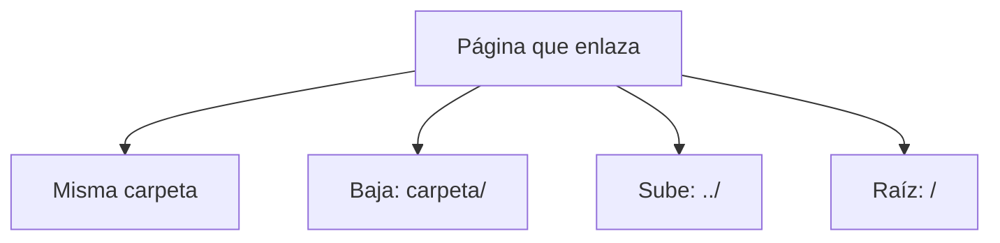

# HTML5

## Unidad 3 · Enlaces y recursos

**Módulos 0373 (LMH) · 0488 (DI)**

Lenguajes de marcas y sistemas de gestión de información (DAW) · Desarrollo de Interfaces (DAM)

Curso 2026/2027

Note:
Bienvenidos a la unidad de enlaces y recursos. Sin `<a>` no hay hipertexto, y sin hipertexto la web sería una carpeta de documentos sueltos. Veremos destinos, rutas, atributos, accesibilidad, imágenes responsive y marcos. Empezamos con una pregunta: ¿cuántos enlaces seguís hoy hasta encontrar una información?

---

## Objetivos de aprendizaje

<span class="fragment">1. Identificar la sintaxis de `<a>` y distinguir <mark>destinos absolutos, relativos y de raíz</mark></span>

<span class="fragment">2. Resolver rutas en un árbol de carpetas con <mark>../ y rutas de raíz</mark></span>

<span class="fragment">3. Aplicar los atributos del enlace: <mark>download, target y rel=noopener</mark></span>

<span class="fragment">4. Diseñar enlaces e imágenes accesibles: <mark>texto descriptivo, alt y aria-label</mark></span>

Note:
Cuatro objetivos que van de la sintaxis a la optimización. El segundo es el que más se falla en prácticas: la ruta se calcula desde la página que enlazas, no desde el explorador. El tercero es directo de examen por el riesgo de tabnabbing y el cuarto conecta con accesibilidad.

---

## Motivación: el hipertexto

<div style="font-size: 1em; text-align: left;">

¿Por qué el enlace es el primer tema de HTML?
</div>

<span class="fragment" style="font-size: 1em;">Sin `<a>` no hay navegación: tendríamos documentos sueltos en una carpeta</span>

<span class="fragment" style="font-size: 1em;">Es el único mecanismo nativo de navegación real entre páginas</span>

<span class="fragment" style="font-size: 1em;">Los buscadores recorren la web siguiendo enlaces: base del SEO técnico</span>

<span class="fragment" style="font-size: 1em;">Mover o renombrar un fichero rompe todas las rutas que lo referencian</span>

Note:
El hipertexto precede a HTML: nació para conectar documentos de la misma red. El cuarto punto es el error que más aparece en prácticas de FP: una ruta no es un texto fijo, depende de dónde esté la página desde la que se escribe. Preguntad en clase por algún fichero que se haya movido sin actualizar los enlaces.

---

## Anatomía del enlace

```html
<!-- El destino va siempre en href: sin él <a> no navega -->
<a href="productos.html">Ver el catálogo de productos</a>

<!-- Es un elemento de línea: cabe dentro de un párrafo -->
<p>Consulta <a href="aviso-legal.html">el aviso legal</a> antes de comprar.</p>
```

<span class="fragment">`href` es obligatorio: sin él no hay enlace, solo texto con su apariencia</span>

<span class="fragment">El texto interior es el nombre accesible y lo que indexan los buscadores</span>

<span class="fragment">`<a>` es de línea (*inline*): se anida en párrafos, listas y cabeceras</span>

Note:
Punto de examen recurrente: un `<a>` sin `href` no navega. También conviene recordar que el texto visible es el nombre accesible por defecto, de ahí la insistencia en describirlo bien. Los destinos que no son páginas los vemos en la siguiente diapositiva.

---

## Tipos de destino: absoluta, relativa y raíz

```html
<!-- Absoluta: URL completa, sales de tu sitio -->
<a href="https://example.org/docs/">Documentación externa</a>
<!-- Relativa: MISMA carpeta, solo el nombre -->
<a href="aviso-legal.html">Aviso legal</a>
<!-- Raíz: no depende de la carpeta actual -->
<a href="/documentos/garantia.pdf">Garantía (PDF)</a>
```

<span class="fragment">La absoluta sale del sitio; la relativa se mueve en tu proyecto</span>

<span class="fragment">`../` sube un nivel desde la página que enlazas</span>

<span class="fragment">Una ruta que empieza por `/` se ancla a la raíz del sitio</span>

<span class="fragment"><mark>La ruta se calcula desde la página que enlazas</mark></span>

Note:
Tres familias de destino y una sola regla de cálculo. La relativa es la más usada porque permite mover el proyecto completo de servidor sin romper nada. La de raíz va bien en menús compartidos, pero falla si el sitio vive dentro de una subcarpeta.

---

## Destinos especiales: ancla, correo y teléfono

```html
<!-- Ancla: destino = id único de la MISMA página -->
<h2 id="envios">Política de envíos</h2>
<a href="#envios">Ir a la política de envíos</a>

<!-- Abre el gestor de correo con asunto opcional -->
<a href="mailto:soporte@mitienda.es?subject=Duda%20sobre%20un%20pedido">Escribir a soporte</a>

<!-- En un móvil inicia la llamada -->
<a href="tel:+34954123456">Llamar al 954 123 456</a>
```

<span class="fragment">`#id` salta a un bloque de la misma página y el `id` debe ser único</span>

<span class="fragment">Con cabecera fija reserva espacio con `scroll-margin-top` en CSS</span>

<span class="fragment">`mailto:` abre el correo; `tel:` inicia la llamada desde un móvil</span>

Note:
Estos tres destinos no son páginas HTML: son un identificador, un correo y un teléfono. El ancla es la base de los índices largos y del enlace «saltar al contenido». Recordad que dos `id` iguales en la misma página rompen el salto.

---

## Cómo se resuelve una ruta



<span class="fragment">Paso 1: la ruta parte de la página que enlazas, no del explorador</span>

<span class="fragment">Paso 2 y 3: bajas con `carpeta/`, subes con `../`, raíz con `/`</span>

Note:
El árbol se resuelve siempre igual: origen, dirección y número de niveles. En un examen dan un árbol de carpetas y una página concreta; lo primero es marcar dónde está esa página. Si la ruta cambia al mover un fichero, era relativa y se contaron mal los niveles.

---

## Atributos: download, target y rel

```html
<!-- Descarga con nombre nuevo: solo mismo origen o con CORS -->
<a href="documentos/garantia.pdf" download="Garantia.pdf">Descargar garantía</a>
<!-- Sin valor conserva el nombre original del fichero -->
<a href="img/zapatillas-1200w.jpg" download>Foto en alta resolución</a>
<!-- target="_blank" viaja SIEMPRE con rel -->
<a href="https://example.org/" target="_blank" rel="noopener noreferrer">Docs</a>
```

<span class="fragment">`download` solo actúa sobre ficheros del mismo origen</span>

<span class="fragment">`target="_blank"` abre en pestaña nueva (por defecto, `_self`)</span>

<span class="fragment"><mark>rel="noopener"</mark> impide `window.opener`: tabnabbing</span>

<span class="fragment">`title` complementa el texto; `hreflang` declara el idioma</span>

Note:
El atributo `download` es sencillo pero tiene trampa: con otro dominio no descarga, navega. El combo `target="_blank"` con `rel="noopener noreferrer"` se exige literal en examen. Usa `title` con moderación porque no todos los lectores de pantalla lo anuncian.

---

## Accesibilidad: nada de «haz clic aquí»

<div style="font-size: 1em; text-align: left;">

El lector lista los enlaces fuera de su contexto.
</div>

| Mal | Bien |
|---|---|
| `Haz clic aquí` | `Ver ofertas de septiembre` |
| `Más información` | `Descargar la nota (PDF)` |

<span class="fragment">Un <mark>enlace descriptivo</mark> se entiende sin el párrafo</span>

<span class="fragment">Icono solo → `aria-label`; imagen interior → `alt=""`</span>

<span class="fragment">WCAG 2.4.4 (nivel A): propósito del enlace determinable</span>

Note:
Los lectores de pantalla construyen una lista de enlaces: si todos dicen «haz clic aquí», esa lista no sirve. Por eso el texto tiene que valer por sí solo. El `aria-label` sobrescribe el texto visible, así que debe coincidir con lo que se muestra en pantalla.

---

## Foco visible y skip link

```html
<body>
  <!-- Primer enlace con Tab: salta la cabecera -->
  <a class="skip-link" href="#contenido">Saltar al contenido principal</a>
  <header><nav aria-label="Principal">...</nav></header>
  <main id="contenido"><h1>Zapatillas Run 300</h1></main>
</body>
```

<span class="fragment">El foco nunca se elimina: solo se estiliza con `:focus-visible`</span>

<span class="fragment">El skip link está fuera de pantalla hasta que recibe el foco</span>

<span class="fragment">`aria-label` en `<nav>` distingue menús cuando la página tiene varios</span>

<span class="fragment">Saltar al contenido ahorra Tab en cada enlace de la cabecera</span>

Note:
La combinación de skip link y foco visible es la puerta de entrada de la navegación por teclado. Un `outline: none` mal colocado deja a parte de los usuarios sin saber dónde están. Es el primer chequeo de accesibilidad de cualquier auditoría.

---

## Imágenes: alt correcto y rendimiento

```html
<!-- Informativa: aporta información que no está en el texto -->

<!-- Decorativa: no aporta nada, alt vacío -->

```

<span class="fragment">Informativa → `alt` descriptivo; no empieces por «imagen de»</span>

<span class="fragment">Decorativa → `alt=""`: el lector la salta sin ralentizar</span>

<span class="fragment">`width` y `height` reservan espacio y evitan el salto (CLS)</span>

<span class="fragment">`lazy` solo fuera del pliegue; la principal va con `eager`</span>

Note:
El `alt` es una decisión de contenido, no de relleno: si la imagen informa, descríbela; si decora, déjalo vacío. Las dimensiones en píxeles son la forma más barata de mejorar el CLS. Cuidado con aplicar `lazy` a la imagen principal: retrasaría lo que más se ve.

---

## Imagen responsive: srcset y picture

```html

```

<span class="fragment">Descriptores `400w`, `800w`: tamaño real de cada fichero</span>

<span class="fragment">`sizes` traduce dónde se coloca, expresado en píxeles</span>

<span class="fragment"><mark>srcset y sizes no se mezclan</mark>: pesos en uno, medidas en el otro</span>

<span class="fragment">`src` obligatorio como reserva; `<picture>` añade avif o webp</span>

Note:
El navegador elige la variante según el ancho real que va a ocupar. Sin `sizes` asume el ancho completo y acabas sirviendo imágenes más grandes de la cuenta. `<picture>` resuelve lo que `srcset` no puede: formatos distintos y recortes distintos.

---

## El marco iframe

```html
<iframe
  src="https://www.openstreetmap.org/export/embed.html?bbox=-5.99,37.37"
  title="Mapa de situación de la tienda en Sevilla"
  width="600" height="400" loading="lazy"
  sandbox="allow-scripts allow-same-origin allow-popups">
</iframe>
```

<span class="fragment">`title` es obligatorio: describe el contenido para lectores</span>

<span class="fragment">`sandbox` restringe el documento y los `allow-*` se suman</span>

<span class="fragment">`loading="lazy"` retrasa la carga hasta acercarse al viewport</span>

<span class="fragment">Otros sitios pueden bloquearte con `X-Frame-Options`</span>

Note:
El iframe crea un documento completo dentro de otro: cuesta rendimiento y añade una capa de seguridad que hay que acotar. Muchos dominios prohíben ser incrustados, así que prueba el marco antes de maquetar. Si el vídeo o el PDF son tuyos, el elemento nativo siempre es mejor.

---

## Ejemplo: galería de producto

```html
<main id="contenido">
  <figure>
    
    <figcaption>Vista lateral ·
      <a href="img/zapatillas-1200w.jpg" download>Ampliar</a></figcaption>
  </figure>
</main>
```

<span class="fragment">El skip link apunta a `<main id="contenido">`, primer destino con Tab</span>

<span class="fragment">`figure` + `figcaption` hacen el bloque autónomo y movible</span>

<span class="fragment">El enlace de descarga usa `download` sobre un fichero del mismo origen</span>

<span class="fragment">La imagen principal va con `loading="eager"` por ser visible al inicio</span>

Note:
Este ejemplo junta lo visto: ruta relativa, imagen responsive, enlace de descarga y estructura semántica con destino del skip link. Fijaos en que el `figcaption` incluye un enlace con texto propio, nunca «haz clic aquí». En clase lo ampliamos con una segunda figura en `<picture>`.

---

## Error común: enlaces y rutas rotos

<span class="fragment">⚠ `alt=""` en imagen informativa: el lector la salta entera</span>

<span class="fragment">⚠ `target="_blank"` sin `rel="noopener noreferrer"`: tabnabbing</span>

<span class="fragment">⚠ Contar mal los `../` al mover un fichero de carpeta</span>

<span class="fragment">⚠ Calcular la ruta desde el explorador y no desde la página</span>

<span class="fragment">⚠ Repetir «haz clic aquí»: no dice nada fuera de su contexto</span>

Note:
Los tres primeros son los que más se repiten en las prácticas del módulo. El de las rutas tiene origen psicológico: se cuenta desde donde estás tú y no desde la página que enlaza. Cualquiera de ellos deja enlaces inútiles o contenido invisible para lectores de pantalla.

---

## Autoevaluación

Estás en `producto/zapatillas.html` y necesitas enlazar a `img/logo.svg` y a
`index.html`. ¿Qué escribes en cada caso?

Un `<a>` abre una pestaña nueva sin `rel`. ¿Qué riesgo existe y cómo se llama?

--

<span class="fragment">`../img/logo.svg` (subes a raíz y bajas a `img/`) y `../index.html` (subes un nivel)</span>

<span class="fragment">La página abierta usa `window.opener`: se llama tabnabbing; se evita con `rel="noopener"`</span>

Note:
La primera pregunta es el ejercicio de rutas clásico de examen; si dudáis, dibujad el árbol y marcad la página de origen. La segunda conecta el atributo `rel` con la seguridad, no solo con el estilo. Ambas respuestas se piden completas: ruta con niveles y nombre exacto del atributo.

---

## Claves para el examen

- `href` obligatorio: sin él `<a>` no navega; `#id` salta a un id único
- Relativas: `archivo` misma carpeta, `carpeta/` bajar, `../` subir, `/` raíz
- Destinos: `mailto:`, `tel:` y `#ancla`; `title` con moderación
- `download` solo del mismo origen; `target="_blank"` con `rel="noopener"`
- Texto descriptivo o `aria-label`; el foco se estiliza, nunca se elimina
- `alt` si informa, vacío si decora; `srcset` + `sizes`; `title` en el iframe

Note:
Seis ideas que resumen la unidad entera. La de las rutas y la de `rel="noopener"` son las que más caen en el examen teórico. Si os acordáis de que todo se calcula desde la página enlazante, el resto de apartados de prácticas salen casi solos.
