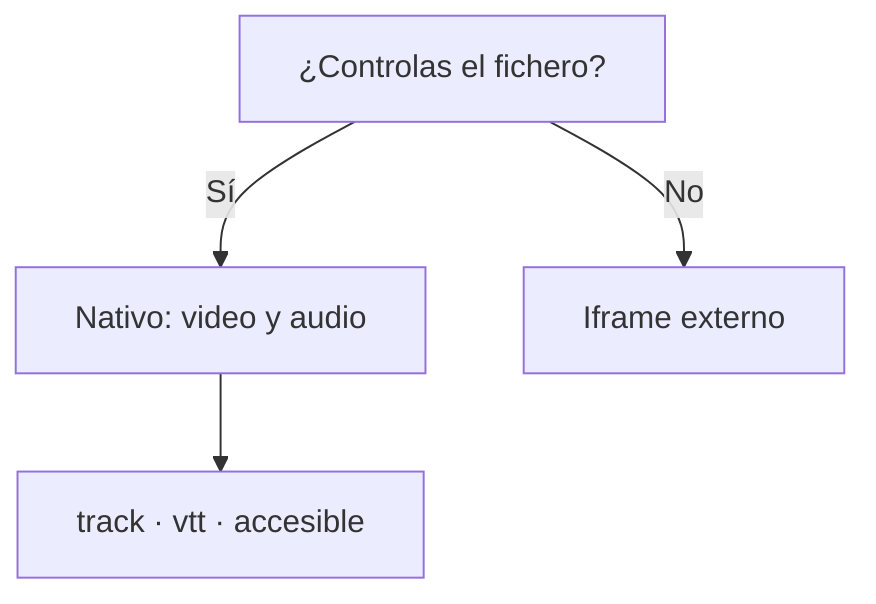

# HTML5

## Unidad 4 · Multimedia en HTML5

**Módulos 0373 (LMH) · 0488 (DI)**

Lenguajes de marcas y sistemas de gestión de información (DAW) · Desarrollo de Interfaces (DAM)

Curso 2026/2027

Note:
Antes de HTML5 la reproducción dependía de plugins externos como Flash; hoy el navegador gestiona el vídeo y el audio de forma nativa. Veremos los atributos de `<video>` y `<audio>`, los formatos que puedes servir, los subtítulos accesibles con `<track>` y los ficheros `.vtt`, además de la incrustación externa. Pregunta de inicio: ¿en qué formato sirve vídeo la última web que visitasteis?

---

## Objetivos de aprendizaje

<span class="fragment">1. Explicar cómo la <mark>reproducción nativa</mark> de `<video>` y `<audio>` sustituyó a los plugins</span>

<span class="fragment">2. Aplicar los atributos clave: <mark>controls, preload, poster y muted</mark></span>

<span class="fragment">3. Elegir formatos compatibles sirviendo <mark>MP4 primero y WebM después</mark></span>

<span class="fragment">4. Hacer el contenido accesible con <mark>track, .vtt y transcripción</mark></span>

Note:
Cuatro objetivos: por qué cambió el modelo, cómo se controla la reproducción, qué se sirve al navegador y cómo se hace accesible. El primero es histórico pero explica por qué todo lo demás es distinto hoy. El cuarto es el que se evalúa con criterios WCAG concretos.

---

## Motivación: del plugin a lo nativo

<div style="font-size: 1em; text-align: left;">

¿Qué perdíamos con Flash, Silverlight o QuickTime?
</div>

<span class="fragment" style="font-size: 1em;">Exigían instalar y actualizar un componente aparte</span>

<span class="fragment" style="font-size: 1em;">Vulnerabilidades conocidas y mucho consumo de batería</span>

<span class="fragment" style="font-size: 1em;">No funcionaban en el iPhone ni los buscadores los leían</span>

<span class="fragment" style="font-size: 1em;">Hoy el navegador baja solo lo necesario gracias a `preload`</span>

Note:
Los plugins eran cajas negras: nada legible para buscadores ni para lectores de pantalla. Con `<video>` y `<audio>` el contenido pasa a formar parte del documento, con foco, subtítulos y estilos propios. Ese cambio de estatus es la clave de la unidad.

---

## El elemento video: atributos clave

<span class="fragment">`controls` muestra la barra: play, tiempo, volumen y pantalla completa</span>

<span class="fragment">Sin `controls` no hay barra, ni atajos, ni volumen</span>

<span class="fragment">`poster` es la imagen que se ve hasta que se pulsa reproducir</span>

<span class="fragment">`preload`: `none` no baja nada, `metadata` duración, `auto` todo</span>

<span class="fragment">`width` y `height` reservan espacio; `loop` repite, `muted` silencia</span>

Note:
`controls` es el atributo imprescindible: sin él el vídeo no se puede reproducir salvo que lo manejes con JavaScript. Es lo primero que se revisa en examen y el error más frecuente en las prácticas. `preload` decide cuántos datos gastas antes de que alguien pulse play.

---

## Varios formatos con source

```html
<video controls poster="img/noticia-portada.jpg" width="640" height="360">
  <!-- Recorre los <source> de arriba abajo: gana el primero compatible -->
  <source src="video/noticia.mp4" type="video/mp4">
  <source src="video/noticia.webm" type="video/webm">
  <!-- Respaldo: se ve solo si el navegador no reconoce <video> -->
  <p>Tu navegador no reproduce vídeo HTML5.
     <a href="video/noticia.mp4">Descarga el clip</a>.</p>
</video>
```

<span class="fragment">Con varios `<source>` no repitas la ruta en el `src` del `<video>`</span>

<span class="fragment">El `type` indica el códec: sin él el navegador no sabe qué probar</span>

<span class="fragment">El texto de respaldo va dentro, después de las pistas</span>

<span class="fragment">El respaldo sirve además de enlace de descarga si algo falla</span>

<span class="fragment">Con un solo formato basta el atajo `src` directo del elemento</span>

Note:
El orden importa: el navegador se queda con el primer `type` que entiende, por eso el códec universal va el primero. Si escribís el `src` en el elemento y además `<source>`, tenéis dos declaraciones del mismo recurso. El párrafo de respaldo solo se muestra si el navegador no reconoce la etiqueta.

---

## Reproducción automática

```html
<!-- Autoplay SOLO aceptado con el sonido silenciado -->
<video autoplay muted loop playsinline
       src="video/banner-tienda.webm"
       width="960" height="400" aria-hidden="true"></video>
```

<span class="fragment">Los navegadores bloquean el `autoplay` con sonido</span>

<span class="fragment">Fórmula válida: `autoplay muted playsinline` (iOS la exige)</span>

<span class="fragment">Si el vídeo lleva sonido, debe activarlo la persona usuaria</span>

<span class="fragment">Lo decorativo se oculta a lectores con `aria-hidden="true"`</span>

Note:
Es una política de navegador, no un capricho del desarrollador: el autoplay con audio se percibe como intrusión. En iOS sin `playsinline` el vídeo salta a pantalla completa. Un banner de este tipo no aporta información, por eso se marca como decorativo.

---

## Formatos y compatibilidad

| Contenido | Formato | Códec | Comentario |
|---|---|---|---|
| Vídeo | **MP4** | H.264 + AAC | El más compatible |
| Vídeo | **WebM** | VP9 / AV1 + Opus | Abierto y ligero |
| Audio | **MP3 / M4A** | MPEG-3 / AAC | Universal |

<span class="fragment">Regla práctica: servir siempre <mark>dos formatos</mark> con `<source>`</span>

<span class="fragment">El códec universal va primero; comprueba el soporte en `caniuse.com`</span>

Note:
La compatibilidad cambia con cada versión de navegador, por eso se recomienda comprobarla en caniuse.com y no fiarse de tablas antiguas. MP4 es el seguro y WebM el estándar abierto y ligero. En audio la triada real es MP3, AAC y Opus.

---

## El elemento audio

```html
<!-- Podcast: formatos múltiples y descarga de respaldo -->
<audio controls preload="none">
  <source src="audio/podcast-clase.mp3" type="audio/mpeg">
  <source src="audio/podcast-clase.ogg" type="audio/ogg">
  <p>Sin audio: <a href="audio/podcast-clase.mp3">Descarga</a>.</p>
</audio>
<!-- Atajo con src directo, un solo formato -->
<audio controls src="audio/podcast-clase.mp3"></audio>
```

<span class="fragment">Admite los mismos atributos que `<video>` salvo `poster`</span>

<span class="fragment">`preload="none"` con varios audios en la misma página</span>

<span class="fragment">No existe lista de reproducción nativa: se construye con JavaScript</span>

<span class="fragment">Mantén un enlace de descarga por si el script no llega a cargar</span>

Note:
`<audio>` es más ligero que `<video>` y comparte el mismo modelo de `<source>`. Con varios episodios en una página, `preload="none"` evita descargarlos todos de golpe. Para una playlist cambiamos el `src` desde JavaScript y llamamos a `play()`, manteniendo siempre un enlace de descarga.

---

## Subtítulos con track

```html
<video controls poster="img/noticia-portada.jpg" width="640" height="360">
  <source src="video/noticia.mp4" type="video/mp4">
  <source src="video/noticia.webm" type="video/webm">
  <!-- Subtítulos en español activados al empezar -->
  <track kind="subtitles" src="video/noticia-es.vtt"
         srclang="es" label="Español" default>
  <!-- Descripción hablada de la acción en pantalla -->
  <track kind="descriptions" src="video/noticia-desc.vtt"
         srclang="es" label="Descripción">
</video>
```

<span class="fragment">Toda pista se declara con `<track>` dentro de `<video>` o `<audio>`</span>

<span class="fragment"><mark>srclang y label obligatorios</mark>; `default` marca la pista activa</span>

<span class="fragment">Las pistas deben subirse al mismo origen que la página</span>

<span class="fragment">Sin `label` el menú de subtítulos queda sin nombres legibles</span>

<span class="fragment">El menú de pistas lo dibuja el reproductor nativo, sin JavaScript</span>

Note:
`srclang` y `label` son obligatorios porque el menú de subtítulos necesita idioma y nombre visibles. Sin `default` nadie activa la pista y el contenido sigue siendo inaccesible por defecto. Si el `.vtt` está en otro dominio sin CORS, el navegador lo rechaza en silencio.

---

## ¿Qué tipo de pista elijo?

<span class="fragment">`subtitles`: traduce la habla a otro idioma o dialecto</span>

<span class="fragment">`captions`: diálogo más efectos sonoros como pasos o música</span>

<span class="fragment">`descriptions`: describe la acción para personas con baja visión</span>

<span class="fragment">`chapters` da puntos de navegación; `metadata`, datos para scripts</span>

<span class="fragment">Para personas sordas o sin sonido, el correcto es `captions`</span>

<span class="fragment">`metadata` aporta datos que después procesa el JavaScript</span>

Note:
La confusión clásica es subtitles frente a captions: uno traduce y el otro incluye lo que se oye además del diálogo. El criterio es el público, no el idioma. Una descripción hablada sirve a quien no ve la pantalla y complementa a los subtítulos.

---

## Fichero vtt y transcripción

<span class="fragment">WebVTT es texto plano: cabecera `WEBVTT` y extensión `.vtt`</span>

<span class="fragment">Bloques numerados con tiempos `HH:MM:SS.mmm --> HH:MM:SS.mmm`</span>

<span class="fragment">El texto de cada bloque es el subtítulo que verá la persona</span>

<span class="fragment">La transcripción completa va en la página, por ejemplo en `<details>`</span>

<span class="fragment">WCAG 1.2.1 exige <mark>alternativa textual</mark>; 1.2.2, subtítulos sincronizados</span>

<span class="fragment">Se guarda con extensión `.vtt` y se enlaza desde el `<track>`</span>

Note:
El formato es intencionadamente simple: se edita en cualquier editor de texto y se versiona sin herramientas. La transcripción en página además da texto indexable y permite leer sin consumir datos. Ambos criterios WCAG son de nivel A, es decir, obligatorios.

---

## Nativo o externo: la decisión



<span class="fragment">El nativo no arrastra cookies ni scripts de terceros</span>

<span class="fragment">Iframe solo cuando el contenido vive en otra plataforma</span>

Note:
Este es el diagrama de decisión de la unidad: primero se pregunta por el control del fichero. Si es tuyo, el reproductor nativo gana en rendimiento, privacidad y accesibilidad. El marco externo es el camino cuando la clase o la conferencia ya están publicadas en otra plataforma.

---

## Incrustar vídeo con iframe

```html
<iframe width="560" height="315"
        src="https://www.youtube-nocookie.com/embed/AbC123XyZ"
        title="Vídeo: presentación del ciclo DAW"
        loading="lazy"
        allow="autoplay; encrypted-media; picture-in-picture"
        allowfullscreen></iframe>
```

<span class="fragment">`title` es obligatorio: describe el vídeo para lectores</span>

<span class="fragment">`loading="lazy"` retrasa el reproductor hasta que aparece</span>

<span class="fragment">Las versiones sin cookies respetan la privacidad</span>

<span class="fragment">Con fichero propio, <mark>el reproductor nativo es preferible</mark></span>

Note:
El marco de YouTube trae cookies, scripts y vídeos recomendados de la competencia. Si el material es vuestro, `<video>` es más ligero y controla los subtítulos. El iframe sigue siendo útil para contenido publicado en plataformas externas.

---

## Ejemplo: noticia con vídeo y podcast

```html
<article>
  <video controls preload="metadata" poster="img/becas-portada.jpg">
    <source src="video/becas.mp4" type="video/mp4">
    <source src="video/becas.webm" type="video/webm">
    <track kind="subtitles" src="becas-es.vtt" srclang="es" label="Español" default>
  </video>
  <audio controls preload="none" src="audio/becas-ep07.mp3"></audio>
</article>
```

<span class="fragment">`preload="metadata"` en el vídeo y `preload="none"` en el audio</span>

<span class="fragment">La transcripción completa se publica en un `<details>` de la página</span>

<span class="fragment">Cada `<source>` y cada `<track>` vive en el mismo origen</span>

Note:
El ejemplo junta todo lo visto: dos formatos, pista de subtítulos con `default` y audios con carga diferida. El `<details>` cumple la WCAG 1.2.1 y da texto indexable sin reproducir nada. Fijaos en que cada `<source>` lleva su `type`, que es lo que suele faltar.

---

## Error común: reproducción que no arranca

<span class="fragment">⚠ Olvidar `controls`: no aparece reproductor alguno en pantalla</span>

<span class="fragment">⚠ `autoplay` con sonido: el navegador lo bloquea o lo ignora</span>

<span class="fragment">⚠ `<source>` sin `type`: no se sabe qué códec probar primero</span>

<span class="fragment">⚠ Combinar el `src` del elemento con varios `<source>` a la vez</span>

<span class="fragment">⚠ Pistas sin `srclang`/`label` o `.vtt` sin cabecera `WEBVTT`</span>

Note:
El primero es con diferencia el más frecuente: un vídeo que no arranca casi siempre es un `controls` ausente. Los dos siguientes afectan a la compatibilidad y solo se ven probando en varios navegadores. Los últimos dejan el contenido inaccesible aunque el vídeo funcione perfectamente.

---

## Autoevaluación

Un vídeo muda en el que solo se oyen pasos, música y ruido de fondo va
dirigido a personas sordas: ¿qué `kind` eliges y por qué no basta `subtitles`?

Tu página tiene cinco audios y todos se descargan al abrirla. ¿Qué cambias?

--

<span class="fragment"><code>kind="captions"</code>: recoge diálogo y efectos sonoros; `subtitles` solo traduce la habla</span>

<span class="fragment">`preload="none"` en cada `<audio>`: no se descarga nada hasta pulsar play</span>

Note:
La primera pregunta es la distinción teórica que más se confunde en el examen; la respuesta debe mencionar los efectos sonoros. La segunda conecta `preload` con el coste real de datos en un móvil. Ambas se valoran con el atributo exacto, no con descripciones vagas.

---

## Claves para el examen

- `<video>` y `<audio>` son nativos: sin `controls` no hay reproductor
- Varios `<source>` se prueban de arriba abajo; escribe siempre el `type`
- `preload`: `none` ahorra, `metadata` trae duración, `auto` baja todo
- `autoplay` solo con `muted` y `playsinline`; `poster` imagen de espera
- Formatos: MP4 primero y WebM después; audio en MP3, AAC u Opus
- Accesibilidad: `track` con `kind`, `srclang` y `label`, `.vtt` y transcripción

Note:
Seis ideas que cubren todo el examen de la unidad. Las que más se olvidan son el orden de los `<source>` y la pareja `autoplay muted`. Si recordáis la accesibilidad como trío track, vtt y transcripción, el apartado de criterios WCAG queda cubierto.
