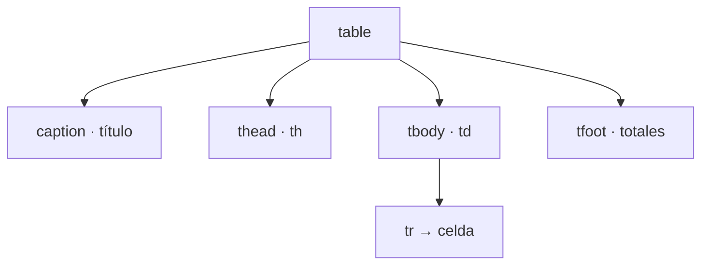

# HTML5

## Unidad 5 · Tablas de datos

**Módulos 0373 (LMH) · 0488 (DI)**

Lenguajes de marcas y sistemas de gestión de información (DAW) · Desarrollo de Interfaces (DAM)

Curso 2026/2027

Note:
Bienvenidos a la unidad de tablas de datos. Una tabla es el único elemento de HTML pensado para relacionar datos que se cruzan en dos dimensiones: horarios, notas, precios. Veremos su estructura semántica completa, cómo combinar celdas sin romper la cuadrícula y cómo dejarla accesible y usable en móvil. Pregunta de arranque: ¿cuántas tablas habéis rellenado esta semana sin sospechar que estábais maquetando?

---

## Objetivos de aprendizaje

<span class="fragment">1. Distinguir cuándo conviene una <mark>tabla de datos</mark> y cuándo Flexbox o Grid</span>

<span class="fragment">2. Escribir la estructura semántica completa: <mark>caption, thead, tbody y tfoot</mark></span>

<span class="fragment">3. Combinar celdas con <mark>colspan y rowspan</mark> y comprobar el recuento de columnas</span>

<span class="fragment">4. Hacer la tabla <mark>accesible</mark> con th, scope y abbr, y <mark>responsiva</mark> con scroll</span>

Note:
Cuatro objetivos encadenados: criterio de uso, estructura, combinación de celdas y accesibilidad. El tercero es el que más se falla en examen porque exige hacer la aritmética fila a fila, no «a ojo». El cuarto conecta con la unidad de accesibilidad de interfaces: una tabla sin scope es ruido para el lector de pantalla. Al terminar deberíais poder construir el horario de clase entero sin desviarte de la cuadrícula.

---

## Motivación · Dos ejes de datos

<div style="font-size: 1em; text-align: left;">

¿Por qué existe `<table>` y no nos basta con `<div>` apilados?
</div>

<span class="fragment" style="font-size: 1em;">Horarios, notas o precios se leen <mark>fila → columna</mark> sin esfuerzo</span>

<span class="fragment" style="font-size: 1em;">El lector de pantalla necesita <mark>relaciones declaradas</mark>, no celdas pintadas</span>

<span class="fragment" style="font-size: 1em;">En móvil una tabla ancha debe <mark>desplazarse</mark>, no romperse</span>

<span class="fragment" style="font-size: 1em;">Maquetar con tablas «funciona», pero acopla el <mark>estilo al marcado</mark></span>

<span class="fragment" style="font-size: 1em;">El modelo tabla es <mark>universal</mark>: se exporta, se imprime y se ordena</span>

Note:
La tabla no es una moda: es la única estructura pensada para datos que se cruzan en dos ejes. El segundo punto es el que justifica todo el bloque de accesibilidad de la unidad. El cuarto avisa del error de partida que encontraréis en cualquier proyecto heredado. Y el último recuerda que fuera del navegador nadie entiende un diseño hecho con divs.

---

## Cuándo SÍ y cuándo NO usar tabla

| Necesito... | Solución |
|---|---|
| Precios o cualquier dato fila × columna | ✅ `<table>` |
| Logo a la izquierda y menú a la derecha | ❌ Flexbox |
| Portada en columnas de tarjetas | ❌ CSS Grid |

<span class="fragment">Test rápido: «para cada fila X, el valor del atributo Y» → <mark>tabla</mark></span>

<span class="fragment">Las tres condiciones a la vez: dos ejes, celdas <mark>atómicas</mark> y lectura natural</span>

<span class="fragment">Regla de oro: la tabla <mark>no</mark> es una herramienta de diseño</span>

Note:
Las tres condiciones se cumplen a la vez: filas y columnas con categoría propia, celdas con un único dato y lectura fila→columna natural. Si dentro de una columna hay un menú o tarjetas con imagen, no es una tabla de datos. Maquetar con `<table>` obliga a anidar tablas e inventar rowspan absurdos, y el lector anuncia datos que no existen. Para distribuir bloques ya conocéis Flexbox y CSS Grid.

---

## Estructura semántica completa

<span class="fragment">`<table>`: contenedor principal; solo <mark>datos tabulares</mark> dentro</span>

<span class="fragment">`<caption>`: título accesible, siempre <mark>el primer hijo</mark> de table</span>

<span class="fragment">`<thead>` agrupa cabeceras · `<tbody>` agrupa datos (puede haber varios)</span>

<span class="fragment">`<tfoot>` agrupa el pie: totales, medias y notas al pie</span>

<span class="fragment">`<tr>` fila · `<th>` celda de encabezado · `<td>` celda de datos</span>

<span class="fragment">Varios `<tbody>` sirven, por ejemplo, para <mark>separar trimestres</mark></span>

Note:
Este es el vocabulario mínimo de la unidad, ocho etiquetas que hay que dominar de memoria. Fijaos en que se admiten varios bloques de datos, algo muy útil cuando el acta se divide por evaluaciones. El `<tfoot>` va siempre al final de la tabla, después de todos los cuerpos, aunque visualmente se pueda pintar arriba.

---

## caption y tbody implícito

<span class="fragment">`<caption>` va <mark>dentro</mark> de table y al principio: no es un título suelto</span>

<span class="fragment">Si escribes `<tr>` directamente, el navegador crea un `<tbody>` <mark>implícito</mark></span>

<span class="fragment">Por eso en CSS se selecciona <mark>tbody > tr</mark>, nunca table > tr</span>

<span class="fragment">`<th>` no es «negrita y ya»: es la celda que <mark>define</mark> a las demás</span>

<span class="fragment">El caption es el <mark>nombre accesible</mark> que el lector anuncia al entrar</span>

Note:
Dos detalles que se olvidan mucho. El caption es el nombre que anuncia el lector al entrar en la tabla, y por eso debe estar dentro de table y ser su primer hijo. Y el tbody implícito explica por qué vuestros selectores CSS no encuentran las filas cuando escribís table > tr. El th, por su parte, es el que porta scope: sin él, las celdas dejan de tener dirección declarada.

---

## Ejemplo · Tabla semántica mínima

```html
<table>
  <caption>Precios con IVA — Taller El Olivo</caption>
  <!-- caption: siempre el primer hijo, es el título accesible -->
  <thead>
    <tr><th scope="col">Producto</th><th scope="col" abbr="Precio">Precio (euros)</th></tr>
  </thead>
  <tbody>
    <tr><th scope="row">Aceite de oliva</th><td>9,50 €</td></tr>
    <tr><th scope="row">Vinagre de Jerez</th><td>4,25 €</td></tr>
  </tbody>
</table>
```

<span class="fragment">`scope="col"` encabeza columna · `scope="row"` encabeza fila · `abbr` = forma corta</span>

<span class="fragment">El `<tbody>` de abajo podría repetirse con el <mark>segundo trimestre</mark> de datos</span>

Note:
Once líneas con todo lo esencial: título accesible, cabecera con scope de columna, filas con scope de fila y abbr para la cabecera larga. Copiad este esqueleto como plantilla de cualquier tabla de datos. En el navegador se ve exactamente igual que una tabla «a pelo», pero el lector anuncia mucho mejor. Os lo pido tal cual en el primer ejercicio práctico de la unidad.

---

## colspan y rowspan · Reglas

<span class="fragment">`colspan="n"`: la celda ocupa n <mark>columnas en su fila</mark></span>

<span class="fragment">`rowspan="n"`: la celda ocupa n <mark>filas en sus columnas</mark></span>

<span class="fragment">El rowspan se declara siempre en la <mark>primera fila</mark> del bloque</span>

<span class="fragment">El colspan puede ir en cualquier fila: solo <mark>suma columnas</mark></span>

<span class="fragment">Las cubiertas <mark>no se escriben</mark>: una `<td></td>` vacía desplaza la fila</span>

Note:
La regla de las celdas cubiertas es la clave de toda la diapositiva siguiente. Un `<td></td>` no es nada: es una celda que empuja el resto hacia la derecha y rompe la alineación de la columna. Por eso se elimina la celda, no se deja en blanco. El colspan, en cambio, es mucho más permisivo porque no afecta a filas posteriores.

---

## Ejemplo · Horario con rowspan y colspan

```html
<table>
  <caption>Horario — 1.º DAW A</caption>
  <thead>
    <tr><th scope="col">Hora</th><th scope="col">Lunes</th><th scope="col">Martes</th></tr>
  </thead>
  <tbody>
    <tr><th scope="row">08:00–10:00</th><td>Programación</td><td rowspan="2">Bases de datos</td></tr>
    <tr><th scope="row">10:00–12:00</th><td>Lenguajes de marcas</td></tr>
    <!-- la celda de Bases de datos NO se repite: la cubre el rowspan -->
    <tr><th scope="row">12:00–14:00</th><td colspan="2">Tutoría de lunes a martes</td></tr>
  </tbody>
</table>
```

<span class="fragment">La fila de las 10:00 escribe 2 celdas + 1 heredada = <mark>3 columnas</mark></span>

<span class="fragment">La última fila cierra con colspan 2: 1 + 2 = <mark>otras 3 columnas</mark></span>

Note:
Aquí conviven los dos mecanismos: un rowspan de dos franjas y un colspan que cruza los dos días. Observad que la segunda fila no repite la celda de Bases de datos y que la de las 12:00 no necesita escribir tres celdas. Comprobadlo con la regla de la diapositiva siguiente antes de darlo por bueno. El navegador lo repara si falla, pero os deja la tabla escalonada.

---

## Recuento de columnas · Comprobación

<span class="fragment">Cuenta las <mark>columnas totales (T)</mark> de la cabecera</span>

<span class="fragment">Fila a fila: +1 por celda escrita + su colspan + las heredadas</span>

<span class="fragment">Si el total no da exactamente T, la tabla está <mark>rota</mark></span>

<span class="fragment">El navegador la repara y la deja <mark>escalonada</mark>: no os fiéis</span>

<span class="fragment">Truco: dibuja la tabla y <mark>tacha</mark> las celdas cubiertas</span>

Note:
Este recuento se hace a mano, fila a fila, nunca a ojo. En el ejemplo anterior T vale 6 en la cabecera, 6 en las dos primeras filas y 6 en la última gracias al colspan. Si falla una fila, todo el diseño se desplaza a partir de ahí y las columnas dejan de coincidir con las de arriba. Es el chequeo que se pide en el examen, así que practicadlo con tres o cuatro filas.

---

## colgroup y col · Columnas enteras

<span class="fragment">`<colgroup>` va justo después de `<caption>` y agrupa `<col>`</span>

<span class="fragment">`span="n"` aplica la definición a n columnas seguidas</span>

<span class="fragment">`<col>` es una etiqueta <mark>vacía</mark>: solo atributos presentacionales</span>

<span class="fragment">Sirve para fondo, borde o ancho de la <mark>columna entera</mark></span>

<span class="fragment">Su `width` es una <mark>sugerencia</mark>: anchos fiables, con CSS</span>

Note:
Colgroup sirve para dar fondo o ancho a una columna entera sin repetirlo celda a celda. El algoritmo de tablas calcula primero lo que necesita cada contenido y después reparte el sobrante, por eso el width puede caer. Con table-layout fixed se invierte el proceso y los anchos se respetan, a cambio de recortar lo que no quepa. Para la práctica de clase basta con CSS sobre tbody th.

---

## Accesibilidad · th, scope y abbr

<span class="fragment">`caption`: nombre de la tabla, se anuncia al <mark>entrar</mark></span>

<span class="fragment">`th`: la celda que <mark>define</mark> a las demás</span>

<span class="fragment">`scope="col"` / `scope="row"` marca la <mark>dirección</mark> del encabezado</span>

<span class="fragment">`abbr`: forma corta para no deletrear frases largas en cada celda</span>

<span class="fragment">Exigido por <mark>WCAG 1.3.1</mark> (Información y relaciones) y 4.1.2</span>

<span class="fragment">Sin datos, tabla decorativa: <mark>role="presentation"</mark> retira la semántica</span>

Note:
Con esta tríada el lector anuncia «Fila 3, Precio, 9,50 €» en lugar de una lista de números sueltos. Scope es el eslabón entre el dato y su fila o su columna, y sin él el texto queda huérfano. No es opcional: está en los criterios de accesibilidad que se evalúan en la clase de interfaces. Role de presentación solo para tablas que no relacionan nada, jamás para datos.

---

## Antes / después · Misma apariencia, otra semántica

<span class="fragment">Antes: encabezados pintados con `<b>` y <mark>sin relación</mark> declarada</span>

<span class="fragment">Después: «Notas de 1.º DAW A. Encabezado Módulo, DIW. Nota, 7,5»</span>

<span class="fragment">Lo <mark>visual</mark> no cambia: lo que cambia es lo que el HTML <mark>declara</mark></span>

```html
<table>
  <caption>Notas de 1.º DAW A</caption>
  <thead>
    <tr><th scope="col">Módulo</th><th scope="col">Nota</th></tr>
  </thead>
  <tbody>
    <tr><th scope="row">DIW</th><td>7,5</td></tr>
  </tbody>
</table>
<!-- Antes: <td><b>Módulo</b></td> sin scope, se anunciaba «Módulo Nota DIW 7,5» suelto -->
```

Note:
Visualmente son idénticas, pero solo la segunda declara relaciones entre las celdas. El lector de pantalla no adivina: lee lo que el marcado dice. Este es el patrón que se pide en el examen práctico de la unidad, y la diferencia se ve en un segundo si probáis las dos versiones con el lector activado.

---

## Tablas responsivas · Scroll en móvil

```html
<figure class="tabla-scroll" tabindex="0" role="region" aria-labelledby="cap">
  <table>
    <caption id="cap">Horario semanal</caption>
    <!-- ... filas ... -->
  </table>
</figure>
```

<span class="fragment">CSS: `overflow-x: auto` → la barra aparece si <mark>desborda</mark></span>

<span class="fragment">`tabindex="0"` <mark>imprescindible</mark>: sin foco no hay flechas (WCAG 2.1.1)</span>

<span class="fragment">`role="region"` + `aria-labelledby`: <mark>región nombrada</mark>; nunca `overflow: hidden`</span>

Note:
Una tabla ancha no cabe en 360 px de pantalla, así que se mantiene la tabla y se desplaza solo ella. El tabindex es lo que permite moverla con el teclado; sin él, la región es inalcanzable para quien no usa el ratón. Conviene además un `min-width` para que la fuente siga siendo legible. Recordad el error clásico: ocultar el desbordamiento en lugar de desplazarlo.

---

## Diagrama · Partes de una tabla



<span class="fragment">Orden: <mark>caption → colgroup → thead → tbody → tfoot</mark></span>

<span class="fragment">Cada nivel <mark>agrupa</mark> el anterior: no hay celdas sueltas</span>

Note:
El árbol resume la jerarquía completa: table es el contenedor, caption el nombre y los tres bloques agrupan filas con sus celdas. Colgroup no aparece porque va justo detrás del caption y no contiene filas. Fotografiad esta diapositiva: os servirá de checklist cuando reviséis si una tabla está bien formada antes de enviarla.

---

## Error común: los tres que más se corrigen

- ⚠ Escribir la fila inferior <mark>completa</mark>: se desplazan las columnas

- ⚠ Usar `<table>` para <mark>maquetar</mark>: eso es de Flexbox y Grid

- ⚠ `<th>` sin `scope`: el lector no vincula fila ni columna

- ⚠ Olvidar `<caption>`: la tabla queda sin <mark>título accesible</mark>

- ⚠ `<td></td>` vacía «para cuadrar»: <mark>sigue ocupando</mark> su hueco

Note:
El primero es el fallo clásico con rowspan y rompe la tabla entera de un golpe. Los dos últimos son los que más restan en la rúbrica de accesibilidad. Maquetar con tablas es el error de concepto más grave, porque además arrastra HTML ilegible y estilo acoplado al marcado. Si corregís solo uno antes de entregar, corregid el primero.

---

## Autoevaluación

<div style="font-size: 1em; text-align: left;">

Una tabla de notas declara `<th>DIW</th>` en la primera columna, pero **ningún `th` lleva `scope`**. ¿Qué anuncia el lector de pantalla?

</div>

<span class="fragment" style="font-size: 1em;">Anuncia el texto <mark>suelto y huérfano</mark>: «DIW» sin saber si es fila o columna</span>

<span class="fragment" style="font-size: 1em;">Solución: <mark>scope="row"</mark> en los th de fila y <mark>scope="col"</mark> en los de cabecera</span>

Note:
Dejad que respondan antes de pulsar para que aparezca la solución. La clave es que sin scope el dato pierde su contexto: el lector no puede decir de qué fila o columna habla. Es la pregunta de examen más típica de esta unidad. La comprobación en clase es abrir dos versiones del mismo HTML y escuchar la diferencia.

---

## Claves para el examen

- `<table>` solo para <mark>datos</mark>; para layout, Flexbox o Grid

- Orden: caption → colgroup → thead / tbody → <mark>tfoot</mark>

- `<th>` con <mark>scope="col"</mark> o <mark>scope="row"</mark>

- colspan une columnas; rowspan une filas y las cubiertas <mark>no se escriben</mark>

- Responsivo: `overflow-x: auto` + <mark>tabindex="0"</mark> + role="region"

- `<col>` da estilo a la columna entera; su width puede <mark>ignorarse</mark>

Note:
Seis ideas para repasar cinco minutos antes del examen. Las tres primeras son pura sintaxis, la cuarta es la aritmética que se comprueba a mano y las dos últimas conectan accesibilidad con responsive. Si os acordáis del orden de los hijos de `<table>`, ya tenéis medio examen. El resto se consigue practicando con un horario real.
