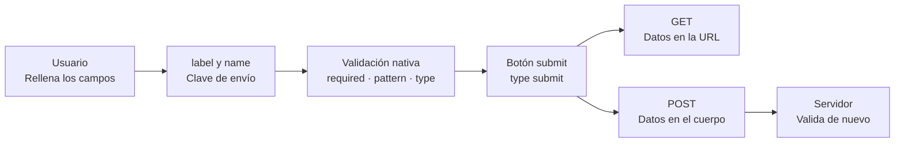

# HTML5

## Unidad 6 · Formularios HTML5

**Módulos 0373 (LMH) · 0488 (DI)**

Lenguajes de marcas y sistemas de gestión de información (DAW) · Desarrollo de Interfaces (DAM)

Curso 2026/2027

Note:
Bienvenidos a la unidad de formularios. Un formulario es la puerta de entrada de datos hacia el servidor: sin label, sin name o con el method equivocado, el dato se pierde o el usuario no puede escribir. Veremos el elemento form, los tipos de input con su validación nativa y la accesibilidad de los campos. Pregunta de arranque: ¿qué campos rellenáis cada día sin pensar en cómo funcionan?

---

## Objetivos de aprendizaje

<span class="fragment">1. Configurar `<form>` con la <mark>action</mark> y el <mark>method</mark> adecuados según el tipo de dato</span>

<span class="fragment">2. Asociar cada campo con <mark>label for / id</mark> y agrupar con fieldset y legend</span>

<span class="fragment">3. Aprovechar los <mark>tipos de input</mark> y la validación nativa: required, pattern, min y max</span>

<span class="fragment">4. Entregar formularios <mark>accesibles</mark>: errores anunciados y orden de tabulación natural</span>

Note:
Cuatro objetivos: envío, etiquetado, validación y accesibilidad. El segundo es el más incumplido en los ejercicios, porque cuesta menos usar el placeholder y al principio parece igual. El cuarto es transversal y se evalúa en la clase de interfaces con los errores asociados a cada campo. Al terminar deberíais montar una matrícula completa que llegue entera al servidor.

---

## Motivación · El formulario no perdona

<div style="font-size: 1em; text-align: left;">

¿Qué puede salir mal en un campo de texto?
</div>

<span class="fragment" style="font-size: 1em;">Sin `name`, el dato se rellena pero <mark>no viaja</mark> al servidor</span>

<span class="fragment" style="font-size: 1em;">Sin `label`, el usuario no sabe qué campo <mark>rellena</mark></span>

<span class="fragment" style="font-size: 1em;">Con GET, una contraseña queda en la <mark>barra de dirección</mark> y en el historial</span>

<span class="fragment" style="font-size: 1em;">El navegador valida gratis y elige el <mark>teclado</mark> adecuado en móvil</span>

<span class="fragment" style="font-size: 1em;">Un error tardío obliga a <mark>reescribir</mark> todo el formulario</span>

Note:
Un formulario mal planteado pierde datos en silencio: no hay error, simplemente no llega nada. Los tres primeros puntos son fallos que se detectan en dos minutos con la pestaña Network de las DevTools. El cuarto es el argumento a favor de usar bien los tipos de input. Y el último explica por qué el etiquetado se corrige al principio, no al final.

---

## El elemento form · GET vs POST

| | GET | POST |
|---|---|---|
| Dónde van los datos | En la URL: `buscar?nota=8` | En el cuerpo de la petición |
| Longitud | Limitada (unos 2.000-8.000 car.) | Sin límite práctico |
| Efecto | Consulta, repetible | Escritura, crea o modifica |

<span class="fragment">Cada campo viaja como `clave=valor` usando su atributo <mark>name</mark></span>

<span class="fragment">Regla: datos <mark>sensibles o largos</mark> → POST; consultas → GET</span>

<span class="fragment">GET aparece en historial, caché y <mark>logs</mark> de proxy y servidor</span>

Note:
`action` dice dónde se envía y `method` cómo. GET deja la petición en el historial, en caché y en los logs, por eso credenciales, DNI y tarjetas van siempre con POST. Fijaos en que la clave de cada par es el name del campo, no su id. La fila de la longitud explica por qué una subida de fichero jamás puede ir con GET.

---

## name, id, enctype y novalidate

<span class="fragment">`name` es la <mark>clave de envío</mark>: sin él el dato no llega jamás</span>

<span class="fragment">`id` es el identificador único que enlaza el campo con su etiqueta</span>

<span class="fragment">Mismo campo, dos papeles: <mark>name viaja</mark>, id solo ancla y estiliza</span>

<span class="fragment">`enctype` por defecto: `application/x-www-form-urlencoded`</span>

<span class="fragment">Con `type="file"` es obligatorio <mark>multipart/form-data</mark></span>

<span class="fragment">`novalidate` apaga la validación nativa para validar con JavaScript</span>

Note:
La pareja name e id es la más confundida de la unidad: el name viaja en la petición y el id solo sirve para anclajes, etiquetas y CSS. El enctype multipart abre un límite por parte y añade cabeceras Content-Disposition, por eso es el único válido para subir ficheros. Novalidate se usa cuando los mensajes deben salir con vuestro diseño, pero no os olvidéis de que luego hay que validar.

---

## label · La pieza obligatoria

```html
<label for="nombre">Nombre y apellidos</label>
<input type="text" id="nombre" name="nombre">
<!-- for debe coincidir EXACTAMENTE con el id del campo -->
```

<span class="fragment">Da <mark>área de clic</mark>: al pulsar el texto se enfoca el campo</span>

<span class="fragment">`placeholder` ≠ `label`: se borra al escribir y <mark>no es su nombre</mark></span>

<span class="fragment">El placeholder solo sirve como <mark>pista de formato</mark>, nunca como etiqueta</span>

<span class="fragment">Con campo precargado, sin label visible <mark>no se entiende</mark> qué hay ahí</span>

Note:
También se puede envolver el campo dentro del label, pero con varios campos juntos la pareja for e id es más clara y más fácil de revisar. El label visible es obligatorio por accesibilidad: el placeholder desaparece y el lector no lo toma como nombre del campo. El objetivo cómodo en táctil también depende de esta etiqueta. Es el error que más se corrige en la práctica, así que fijaos bien.

---

## fieldset y legend · Agrupar opciones

```html
<fieldset>
  <legend>Turno de matrícula</legend>
  <input type="radio" id="manana" name="turno"><label for="manana">Mañana</label>
  <input type="radio" id="tarde" name="turno"><label for="tarde">Tarde</label>
</fieldset>
```

<span class="fragment">Los radios comparten el <mark>mismo name</mark>: solo uno se marca</span>

<span class="fragment">Cada control lleva su `id` y su `<label for>`</span>

<span class="fragment">Sin legend se anuncia «Mañana, 1 de 2» y <mark>se pierde el grupo</mark></span>

<span class="fragment">Los checkbox son <mark>independientes</mark>: cada uno con su name</span>

Note:
El legend es el nombre accesible del bloque y el lector lo repite antes de cada opción del grupo. Los checkbox, en cambio, son independientes y cada uno lleva su name propio. Es la diferencia entre un grupo que se entiende y una lista de opciones sueltas sin contexto. En la práctica de matrícula vais a usar dos fieldset: datos personales y turno.

---

## Tipos de input · Validación y teclado

<span class="fragment">`email` y `url` validan el <mark>formato</mark> antes de enviar</span>

<span class="fragment">`number` con `min`, `max` y `step` · `range` · `date` · `color` · `file`</span>

<span class="fragment">`tel` y `search` <mark>no validan</mark>: compruébalos en el servidor</span>

<span class="fragment">El `type` decide qué <mark>teclado</mark> aparece en el móvil</span>

<span class="fragment">`hidden` está oculto, no editable, pero <mark>sí se envía</mark></span>

<span class="fragment">La validación nativa garantiza <mark>forma</mark>, no que el dato sea verdadero</span>

Note:
El type es doble funcionamiento: validación en cliente y teclado virtual en móvil. Un correo con arroba pasa el navegador, pero eso no garantiza que la casilla exista. Por eso el servidor siempre valida de nuevo: la validación en cliente es comodidad, no seguridad. Recordad también que date y time ahorran escribir en el teclado.

---

## required, readonly y disabled

```html
<input type="text" id="dni" name="dni" required>
<input type="text" id="curso" name="curso" value="2026-2027" readonly>
<input type="text" id="codigo" name="codigo" value="DAW-A" disabled>
```

<span class="fragment">`required`: <mark>bloquea el envío</mark> hasta que el campo tenga valor</span>

<span class="fragment">`readonly`: visible, tabulable y <mark>sí se envía</mark></span>

<span class="fragment">`disabled`: gris, sin foco y <mark>no se envía</mark>, como si no existiera</span>

<span class="fragment">Los tres parecen «campo que no se toca»: la diferencia está en el <mark>envío</mark></span>

Note:
Los tres se confunden porque los tres parecen campos que el usuario no debe tocar. La diferencia está en el envío y en el foco: readonly sigue participando en el formulario y disabled queda fuera por completo. El required, además, deja el valor calculado del campo sí o sí dentro de la petición. Este trío es la base de la autoevaluación de la unidad.

---

## pattern y min / max / step

```html
<label for="nif">NIF</label>
<input type="text" id="nif" name="nif" pattern="[0-9]{8}[A-Za-z]"
       title="8 dígitos y una letra, ej.: 12345678Z" required>
```

<span class="fragment">`pattern` recibe una <mark>expresión regular</mark> que cubre todo el valor</span>

<span class="fragment">El navegador añade `^` y `$`; sensible a <mark>mayúsculas</mark></span>

<span class="fragment">`title` describe el formato y alimenta el <mark>mensaje de error</mark></span>

<span class="fragment">`step` por defecto es 1: con 0,5 admite 7,5 pero <mark>no 7,3</mark></span>

<span class="fragment">`minlength` y `maxlength` miden <mark>caracteres</mark> y maxlength corta al escribir</span>

Note:
Pattern valida el formato completo del campo, no fragmentos sueltos, porque el navegador añade anclas de inicio y fin. Sensibilidad a mayúsculas: si escribís a-z, una A no pasa. El title es doble uso, mensaje para el navegador y descripción para el lector de pantalla. Y el par min y max trabaja igual en number, range y date.

---

## select, textarea y salidas

<span class="fragment">`<select>`: se envía el <mark>value</mark>; sin value, se envía el texto de la opción</span>

<span class="fragment">`optgroup` agrupa con subtítulo y `selected` <mark>precarga</mark> una opción</span>

<span class="fragment">`<textarea>`: el texto va <mark>entre las etiquetas</mark>, no usa value</span>

<span class="fragment">`<progress>` = cómo va una tarea · `<meter>` = <mark>en qué estado</mark> está una cantidad</span>

<span class="fragment">`<output>` guarda el resultado <mark>calculado</mark>: la media o el total</span>

<span class="fragment">`required` en select exige una opción inicial <mark>vacía y deshabilitada</mark></span>

Note:
La distinción clave entre progress y meter es temporal: uno mide avance hacia una meta y otro mide un valor con umbrales que se colorean solos. En select, el required necesita esa opción trampa vacía para que el usuario tenga que elegir algo de verdad. El textarea no tiene value porque el contenido ya está entre sus etiquetas. Los tres elementos de resultado son de examen frecuente.

--

## Controles especiales: select, progress y meter

<span class="fragment"><code>&lt;select&gt;</code> envía el atributo <code>value="..."</code> de la opción (código interno tipo "ES"), no el texto visual ("España")</span>

<span class="fragment"><strong>Patrón select required:</strong> La primera opción debe ser <code>&lt;option value="" disabled selected&gt;Elige país...&lt;/option&gt;</code></span>

<span class="fragment"><code>&lt;progress value="70" max="100"&gt;</code>: tarea que avanza en el tiempo hacia el 100% (subida de archivo, descarga)</span>

<span class="fragment"><code>&lt;meter value="85" min="0" max="100" optimum="90"&gt;</code>: medición estática o depósito (batería, memoria RAM, nota de examen) con zonas verde/amarillo/rojo</span>

<span class="fragment"><code>&lt;button&gt;</code> trampa: por defecto es <code>type="submit"</code>; para disparar JS debe llevar <code>type="button"</code></span>

Note:
Explicación detallada para los alumnos:
1. En select, si no pones el value="" vacío en la primera opción, el formulario enviará esa primera opción por defecto aunque el usuario no la haya elegido.
2. progress representa progreso temporal (va a terminar). meter representa un indicador o manómetro físico (sube y baja, tiene valores óptimos o peligrosos).
3. button sin type: si un alumno hace un botón para abrir un popup o hacer un cálculo y no pone type="button", la página se recargará porque intenta enviar el formulario al servidor.

---

## button y validación nativa

- ⚠ `<button>` sin `type` equivale a <mark>submit</mark>: escribe type="button"

- ⚠ `type="reset"` restaura los <mark>valores iniciales</mark> del formulario

- Los globos de error <mark>no se estilan</mark>: `:invalid`, `:valid`, `:user-invalid`

- `novalidate` más Constraint API (`checkValidity`) para errores propios

- La validación definitiva, aunque falle el cliente, es del <mark>servidor</mark>

Note:
El type por defecto del button es el fallo número uno del módulo: un botón «Calcular media» sin type envía el formulario entero. Y si queréis mensajes con vuestra marca, se apaga novalidate, pero manteniendo required y pattern en el HTML. La pseudoclase user-invalid evita que la página arranque entera en rojo. Constraint API da el motivo exacto de cada error en JavaScript.

---

## Ejemplo práctico · Formulario completo y accesible

```html
<form action="/matricula" method="post" enctype="multipart/form-data">
  <fieldset>
    <legend>Datos personales</legend>
    <label for="nombre">Nombre y apellidos</label>
    <input type="text" id="nombre" name="nombre" autocomplete="name" required>
    <label for="dni">DNI/NIE</label>
    <input type="text" id="dni" name="dni" pattern="[0-9]{8}[A-Za-z]"
           aria-describedby="pista-dni" required>
    <span id="pista-dni">Ejemplo: 12345678Z</span>
    <label for="nacimiento">Fecha de nacimiento</label>
    <input type="date" id="nacimiento" name="nacimiento" required>
  </fieldset>
  <fieldset>
    <legend>Turno de matrícula</legend>
    <input type="radio" id="manana" name="turno" value="manana" required>
    <label for="manana">Mañana</label>
    <input type="radio" id="tarde" name="turno" value="tarde">
    <label for="tarde">Tarde</label>
  </fieldset>
  <label for="cv">Currículum (PDF)</label>
  <input type="file" id="cv" name="cv" accept=".pdf, application/pdf">
  <input type="checkbox" id="terminos" name="terminos" value="si" required>
  <label for="terminos">Acepto la normativa del centro</label>
  <button type="submit">Enviar matrícula</button>
</form>
```

<span class="fragment"><code>enctype="multipart/form-data"</code> imprescindible para transmitir ficheros (<code>&lt;input type="file"&gt;</code>)</span>

<span class="fragment"><code>&lt;fieldset&gt;</code> + <code>&lt;legend&gt;</code> contextualizan grupos de campos (datos y radios excluyentes)</span>

<span class="fragment">Validación nativa en cliente: <code>pattern</code>, <code>required</code> y <code>aria-describedby</code> para pistas</span>

Note:
Arquitectura completa de formularios accesibles:
1. method="post" para proteger datos sensibles del payload HTTP, y enctype="multipart/form-data" para permitir subida de archivos binarios (PDF).
2. legend anuncia el contexto ("Turno de matrícula, Mañana, 1 de 2") evitando desorientación con sintetizadores de voz.
3. aria-describedby vincula la ayuda contextual ("Ejemplo: 12345678Z") al foco del lector antes de escribir.
4. Los botones de radio comparten el atributo name para garantizar exclusión mutua, y la casilla checkbox con required bloquea el envío nativo si no se acepta la normativa.

---

## Ejemplo · Mensaje de error accesible

```html
<label for="email">Correo electrónico</label>
<input type="email" id="email" name="email" required aria-required="true"
       aria-describedby="err-email" aria-invalid="true">
<p id="err-email" role="alert">Debe tener formato usuario@dominio.com</p>
<!-- aria-describedby enlaza el mensaje; role=alert lo anuncia al aparecer -->
```

<span class="fragment">`label` <mark>visible siempre</mark>, nunca solo placeholder</span>

<span class="fragment">El orden de `Tab` debe coincidir con el <mark>orden visual</mark>, sin tabindex positivos</span>

<span class="fragment">El mensaje describe, declara el estado y <mark>lo anuncia</mark> en cuanto aparece</span>

Note:
Tres atributos y un párrafo resuelven el error accesible: describe el porqué, declara el estado y lo anuncia en cuanto aparece. Sin role alert el lector se entera solo si vuelve al campo con el tabulador. Comprobadlo en el aula con un lector de pantalla: se escucha en un segundo y convence más que cualquier explicación. Este patrón es el que se pide en el examen práctico.

---

## Diagrama · Flujo de envío



<span class="fragment">El cliente facilita, pero la <mark>validación definitiva</mark> es del servidor</span>

<span class="fragment">El método sale del <mark>form</mark>, no del botón que pulsa el usuario</span>

Note:
El flujo completo va del campo al servidor pasando por la validación nativa, que solo se salta si declaramos novalidate. Fijaos en que GET y POST salen del mismo botón: la diferencia está en el method del formulario. Si algo falla, el servidor es quien devuelve el error real y la respuesta correcta al navegador.

---

## Error común: el placeholder no es un label

- ⚠ Usar el `placeholder` como etiqueta: al escribir <mark>desaparece</mark>

- ⚠ Enviar login o DNI con <mark>method="get"</mark>: queda en el historial

- ⚠ Campo sin `name`: el dato <mark>no viaja</mark> al servidor

- ⚠ `<button>` sin `type` en «Calcular media»: <mark>envía</mark> sin querer

- ⚠ `for` que no coincide con el `id`: <mark>no enfoca</mark> el campo

Note:
El primero es el que más se corrige en práctica: sin label visible, el campo precargado no se entiende y el lector no anuncia nada. El segundo es también un problema de seguridad, no solo de usabilidad. Los últimos son fallos silenciosos que solo se ven al mirar la petición o el foco en las DevTools. Revisad siempre la pestaña Network antes de dar el ejercicio por entregado.

---

## Autoevaluación

<div style="font-size: 1em; text-align: left;">

Tres campos: `dni` con `required`, `curso` con `readonly` y `codigo` con `disabled`. Si se cumplimentan y se envía el formulario, ¿qué recibe el servidor?

</div>

Note:
Dejad pensar antes de pasar a la respuesta de abajo con la flecha inferior. El truco está en distinguir «bloquea el envío» de «no se envía»: el required solo actúa si está vacío. Si dudáis, la respuesta es comprobable en dos minutos con las DevTools y la pestaña Network. Es la pregunta de examen más habitual de esta unidad.

--

## Respuesta · Qué llega al servidor

<span class="fragment">`dni` con required: si está vacío, el navegador <mark>ni deja enviar</mark></span>

<span class="fragment">`curso` con readonly: <mark>sí se envía</mark>, sigue visible, enfocable y con nombre</span>

<span class="fragment">`codigo` con disabled: <mark>no se envía</mark>, como si no existiera</span>

<span class="fragment">En cambio, un campo required <mark>con valor</mark> viaja igual que cualquier otro</span>

Note:
Este es el trípode de estados de un campo y se pregunta mucho. La comprobación es trivial: abrid DevTools, pestaña Network, enviad y mirad el cuerpo de la petición. Si un campo no aparece, estaba deshabilitado. Si el navegador ni os deja enviar, había un required vacío.

---

## Claves para el examen

- `<form>` = action (dónde) + method (cómo): <mark>GET</mark> consultas, POST sensibles

- `label for` con `id` obligatorio; el <mark>placeholder</mark> nunca lo sustituye

- Sin <mark>name</mark> no se envía; readonly sí se envía, disabled no

- El `type` aporta <mark>validación y teclado móvil</mark>

- `fieldset` con `legend` agrupan; los radios comparten el <mark>name</mark>

- `<button>` sin `type` equivale a <mark>submit</mark>: escribe el type

Note:
Seis ideas para el repaso final: envío, etiquetado, envío del dato, tipos, grupos y botones. Las dos primeras son las que más se olvidan en el primer ejercicio práctico. Y recordad siempre que el servidor valida de nuevo, aunque el navegador ya lo haya hecho. Con esto y con práctica tenéis la unidad cubierta.
