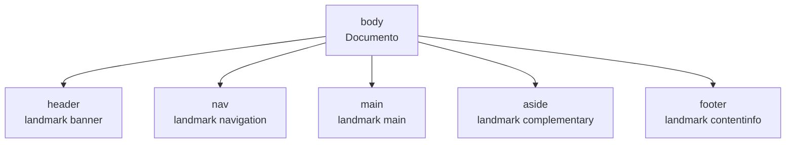

# HTML5

## Unidad 7 · Estructura semántica y ARIA

**Módulos 0373 (LMH) · 0488 (DI)**

Lenguajes de marcas y sistemas de gestión de información (DAW) · Desarrollo de Interfaces (DAM)

Curso 2026/2027

Note:
Bienvenidos a la unidad de estructura semántica y ARIA. Vamos a levantar el esqueleto de una página con los elementos de sección nativos, el skip link, la jerarquía de encabezados y un uso de ARIA justo y necesario. Recordad que la semántica es información que ya viaja en el HTML, no en CSS. Pregunta para empezar: ¿cuántos elementos de sección sabéis nombrar de memoria?

---

## Objetivos de aprendizaje

<span class="fragment">1. Diferenciar <mark>semántica</mark> de divitis y justificar su efecto en SEO y accesibilidad</span>

<span class="fragment">2. Emplear los <mark>siete elementos de sección</mark> y sus landmarks implícitos</span>

<span class="fragment">3. Montar un esqueleto con <mark>skip link, main único y encabezados sin saltos</mark></span>

<span class="fragment">4. Aplicar ARIA con la regla de oro: <mark>primero el HTML nativo</mark></span>

Note:
Cuatro objetivos; el tercero es el práctico clave: vais a levantar una página completa con salto de contenido y jerarquía correcta. El cuarto es transversal porque ARIA mal usado empeora la accesibilidad en lugar de mejorarla. Los dos primeros son la base de teoría del examen.

---

## Motivación · Tres lectores del mismo HTML

<div style="font-size: 1em; text-align: left;">

¿Quién lee tu marcado, además del navegador?
</div>

<span class="fragment" style="font-size: 1em;"><mark>Máquina</mark>: los buscadores distinguen el artículo de un anuncio</span>

<span class="fragment" style="font-size: 1em;"><mark>Accesibilidad</mark>: el lector navega por landmarks y encabezados</span>

<span class="fragment" style="font-size: 1em;"><mark>Mantenimiento</mark>: tú, dentro de meses, adivinando la intención de cada div</span>

<span class="fragment" style="font-size: 1em;">Con una sopa de divs, los tres lectores ven lo mismo: <mark>cajas</mark></span>

Note:
La organización de una página tiene tres destinatarios distintos. Si esa estructura solo existe en clases CSS, el buscador, el lector de pantalla y el mantenimiento la ignoran por completo. La semántica no es estética: es significado que viaja gratis en el marcado.

---

## Ejemplo: de la divitis a la semántica

```html
<!-- MAL: Cuatro divs: la máquina solo ve cajas -->
<div class="cabecera">
  <div class="menu"><div class="titulo">DAW</div></div>
</div>

<!-- BIEN: mismo aspecto, significado explícito -->
<header class="cabecera">
  <nav class="menu"><h1>DAW</h1></nav>
</header>
```

<span class="fragment">Con <code>div</code> hay que reescribir a mano <mark>role, tabindex y JS</mark></span>

<span class="fragment">El segundo bloque ya trae <mark>landmarks</mark> y orden de lectura correctos</span>

Note:
Este es el coste real de la divitis: reescribir a mano lo que el HTML regala. Cada div obliga a reimplementar teclado, foco y nombre accesible desde cero. Mismo aspecto visual, dos significados opuestos para el lector de pantalla.

---

## Los siete elementos de sección

<span class="fragment"><mark>header · nav · main · article · section · aside · footer</mark></span>

<span class="fragment"><code>main</code> es <mark>único</mark>: contiene lo principal y no lo repetido</span>

<span class="fragment"><code>article</code> es contenido independiente; <code>section</code>, un tema con título</span>

<span class="fragment"><code>nav</code> solo si es navegación de verdad; <code>aside</code> es complementario</span>

| Elemento | Landmark | Condición |
|---|---|---|
| `<header>` | `banner` | solo hijo directo de `<body>` |
| `<footer>` | `contentinfo` | solo hijo directo de `<body>` |
| `<main>` | `main` | único visible en la página |

Note:
La tabla resume los matices de examen: banner y contentinfo solo se activan cuando header y footer son hijos directos de body. Un header dentro de article no es banner, y el pie de un artículo tampoco es contentinfo. article no trae landmark propio y section solo lo es si recibe un nombre accesible.

---

## section o div: el criterio

<span class="fragment">Bloque con <mark>tema propio y encabezado propio</mark> → section</span>

<span class="fragment">Bloque que existe <mark>solo por la maquetación</mark> → div</span>

<span class="fragment">Una section sin título suele ser un div con otro nombre</span>

<span class="fragment">Para nombrar la región: <code>aria-labelledby</code> apuntando al id del h2</span>

<span class="fragment">No hay premio por usar menos divs: <mark>el div sigue siendo válido</mark></span>

Note:
La pregunta es si el bloque suena a «sección de…» o a «caja de…». Si tiene tema y encabezado propios es section; si solo agrupa tarjetas en una rejilla, sigue siendo div. El error típico es forzar section donde nunca hubo un título.

---

## Esqueleto de página completo

```html
<body>
  <a class="skip-link" href="#contenido">Saltar al contenido</a> <!-- PRIMER enlace -->
  <header class="cabecera">          <!-- hijo de body => banner -->
    <h1 class="logo"><a href="/">El Cuaderno</a></h1>
    <nav aria-label="Principal"><ul>…</ul></nav>
  </header>
  <main id="contenido" tabindex="-1"> <!-- landmark main: SOLO UNO -->
    <article>…</article>
  </main>
  <aside class="barra-lateral">…</aside>
  <footer class="pie">…</footer>     <!-- hijo de body => contentinfo -->
</body>
```

<span class="fragment">Landmarks: <mark>banner · navigation · main · complementary · contentinfo</mark></span>

<span class="fragment">El <code>div.rejilla</code> es <mark>solo maquetación</mark>: no aporta significado</span>

Note:
Este esqueleto es la base del ejercicio de portafolio semántico. Cada etiqueta cumple una función concreta y el div de la rejilla se queda donde está, en el terreno del CSS. Fijaos en el skip link y en tabindex: los detallamos en la diapositiva siguiente.

---

## El skip link

```html
<body>
  <!-- Debe ser el PRIMER enlace del DOM -->
  <a class="skip-link" href="#contenido">Saltar al contenido principal</a>
  <header> … menú con 12 enlaces … </header>
  <!-- destino: el id de main; tabindex lo enfoca sin salir del Tab -->
  <main id="contenido" tabindex="-1">
    <h1>Contenido principal</h1>
  </main>
</body>
```

<span class="fragment">Se oculta con <code>left: -9999px</code> y aparece <mark>solo con el foco</mark></span>

<span class="fragment"><code>tabindex="-1"</code> enfoca <code>main</code> <mark>sin entrar en el Tab</mark></span>

<span class="fragment">Prueba de clase: <mark>Tab → Intro → Tab</mark> y el foco queda en el contenido</span>

<span class="fragment">Nunca lo ocultes con <code>display: none</code>: dejaría de ser enfocable</span>

Note:
El skip link es el salvavidas de quien navega con teclado: evita tabular treinta enlaces para llegar al contenido. Debe ser el primer elemento enfocable del DOM y quedar visible únicamente cuando recibe el foco. Si no aparece, casi siempre es display none, un href sin id coincidente o que está colocado después del menú.

---

## Jerarquía de encabezados

```html
<!-- MAL: Salto de nivel y dos h1 -->
<h1>Curso de HTML</h1>
<h4>Etiquetas semánticas</h4>

<!-- BIEN: niveles encadenados; el tamaño lo pone CSS -->
<h1>Curso de HTML</h1>
  <h2>Etiquetas semánticas</h2>
    <h3>Elementos de sección</h3>
  <h2>Formularios</h2>
```

<span class="fragment">Un solo <code>h1</code> por página: <mark>el título del documento o de la entrada</mark></span>

<span class="fragment"><mark>Sin saltos de nivel</mark>: h1 → h2 → h3, que funcionan como índice</span>

<span class="fragment">El nivel es <mark>estructural</mark>; el tamaño visual lo decide CSS</span>

<span class="fragment">WCAG 1.3.1 exige que las relaciones se determinen <mark>programáticamente</mark></span>

Note:
Si el título de una sección es un div con fuente grande, esa relación no existe para la máquina y el criterio queda incumplido. Por eso elegir un h4 porque «queda más pequeño» rompe el índice del lector de pantalla. El tamaño se cambia con CSS, jamás con la etiqueta.

---

## ARIA: primero el HTML nativo

```html
<!-- MAL: divitis accesible: teclado, foco y JS a mano -->
<div role="button" class="boton" tabindex="0">Guardar</div>

<!-- BIEN: el nativo lo trae todo GRATIS -->
<button type="button">Guardar</button>
<!-- teclado · foco · nombre accesible · disabled -->
```

<span class="fragment">Regla de oro: <mark>no uses ARIA si un elemento HTML ya hace ese trabajo</mark></span>

<span class="fragment">Cada <code>role</code> de más obliga a reimplementar <mark>teclado, foco y nombre</mark></span>

<span class="fragment">ARIA es un <mark>añadido</mark>, no una capa de estilo accesible</span>

<span class="fragment">Si faltaba un h2, la solución es <mark>el h2</mark>, no un role="heading"</span>

Note:
La especificación lo dice literalmente: no uses ARIA si existe un elemento HTML que haga ese trabajo. Un div con role button no sabe recibir Intro ni Espacio, no tiene estado disabled y hay que programarlo todo. El botón nativo trae todo eso sin escribir una sola línea de JavaScript.

---

## Nombres accesibles: label, labelledby, describedby

<span class="fragment"><code>aria-label</code>: <mark>nombre</mark> donde no hay texto visible, como un icono</span>

<span class="fragment"><code>aria-labelledby</code>: <mark>nombre tomado de otro id</mark> ya existente</span>

<span class="fragment"><code>aria-describedby</code>: <mark>descripción</mark>, se lee después del nombre</span>

<span class="fragment">Orden del nombre: labelledby → label → texto visible → title</span>

<span class="fragment"><code>aria-describedby</code> <mark>nunca sustituye</mark> al nombre accesible</span>

<span class="fragment">Si el texto visible ya existe, no lo repitas en <code>aria-label</code></span>

Note:
La diferencia entre nombre y descripción es el error de examen más frecuente de la unidad. El nombre identifica el control al enfocarlo y la descripción añade ayuda o instrucción después. Repetir el texto visible en aria-label provoca un doble anuncio molesto.

---

## Estado: aria-expanded, aria-hidden, aria-current

```html
<!-- estado de un desplegable: sincronízalo SIEMPRE con el JS -->
<button type="button" aria-expanded="false" aria-controls="menu">Cursos ▾</button>
<ul id="menu" hidden> … </ul>

<span aria-hidden="true">★</span>          <!-- decorativo junto a texto -->
<a href="/" aria-current="page">Inicio</a>  <!-- estás aquí -->
```

<span class="fragment"><code>hidden</code> → <mark>no existe</mark> para nadie: ni foco, ni ratón, ni lector</span>

<span class="fragment"><code>aria-hidden="true"</code> → sigue clicable pero <mark>no se anuncia</mark></span>

<span class="fragment">Si además es enfocable creas un <mark>foco fantasma</mark> que nadie ve</span>

<span class="fragment"><code>aria-expanded</code> es informativo: sin JS <mark>anuncia mentiras</mark></span>

Note:
hidden y aria-hidden no son sinónimos: uno elimina el elemento del árbol accesible y el otro lo deja visible pero silencioso. aria-expanded y aria-current describen estado, y ese estado vive en JavaScript. Con details y summary el navegador ya gestiona el desplegable por ti.

---

## aria-live: regiones que anuncian cambios

```html
<p id="aviso" role="status" aria-live="polite" aria-atomic="true"></p>
<button type="button" onclick="guardar()">Guardar</button>

<script>
function guardar() {
  // role="status" equivale a aria-live="polite": no interrumpe
  document.getElementById('aviso').textContent = 'Cambios guardados ✓';
}
</script>
```

<span class="fragment"><code>polite</code>: <mark>espera su turno</mark>; confirmaciones y resultados</span>

<span class="fragment"><code>assertive</code>: <mark>interrumpe</mark> la lectura; errores reales</span>

<span class="fragment"><code>off</code> es el valor por defecto: <mark>no anuncia nada</mark></span>

<span class="fragment"><code>aria-atomic="true"</code> lee la región <mark>entera</mark>, no solo lo cambiado</span>

Note:
Sin la marca aria-live, el lector de pantalla no se entera de que el contenido cambió. role status es el atajo equivalente a polite y role alert el equivalente a assertive. Úsalo con moderación: una región que habla demasiado acaba siendo ignorada.

---

## Cuándo no usar ARIA

<span class="fragment">No uses <code>aria-label</code> <mark>redundante</mark> con el texto visible del enlace</span>

<span class="fragment">No dupliques: <code>role="navigation"</code> sobre nav <mark>ya lo trae el elemento</mark></span>

<span class="fragment">Roles que empeoran: <code>role="img"</code> con texto dentro de la etiqueta</span>

<span class="fragment">No mantengas <code>aria-expanded</code> sin JS que lo actualice en cada clic</span>

<span class="fragment">No ocultes con <code>aria-hidden</code> contenido <mark>enfocable</mark> con teclado</span>

<span class="fragment">Corrección: <mark>cambia la etiqueta, no añadas roles</mark></span>

Note:
El problema no es que haya mucho ARIA, sino que estorba: produce doble anuncio, doble mantenimiento y estados desfasados. Cada atributo de más es código que alguien tiene que mantener en sincronía. Cuando la solución correcta sea un h2, escribe un h2.

---

## Mapa de landmarks de la página



<span class="fragment">Los landmarks nacen del <mark>elemento y su posición</mark>, no de CSS</span>

<span class="fragment">El lector los <mark>lista y salta</mark>: D va a main, M a navigation</span>

<span class="fragment">Verificación: DevTools → Elements → <mark>Accessibility</mark></span>

<span class="fragment">Prueba final: recorrer la página <mark>solo con Tab</mark>, sin ratón</span>

Note:
El orden visual no es el orden semántico: main y aside comparten fila en CSS pero son hermanos en el DOM. Recorrer la página con los atajos de landmark y con la tecla de encabezados es la prueba rápida de que la estructura es correcta. NVDA en Windows y VoiceOver en macOS bastan para la práctica.

---

## Error común: los tres fallos de la práctica

<span class="fragment"><mark>Dos main</mark> en la página: solo puede haber uno visible</span>

<span class="fragment">Elegir el encabezado <mark>por el tamaño visual</mark> o repetir el h1</span>

<span class="fragment">ARIA de más: label redundante y roles sobre elementos nativos</span>

<span class="fragment">Skip link colocado <mark>después del menú</mark> o con href sin id coincidente</span>

<span class="fragment">Ocultar el enlace de salto con <code>display: none</code></span>

Note:
Los dos primeros son los que más se corrigen en la práctica. Para un segundo bloque de contenido usa section o div, nunca un main adicional. Y el skip link solo funciona si es el primer enlace del DOM y su destino existe literalmente en el id.

---

## Autoevaluación

<span class="fragment">1. ¿Qué landmark trae un header y bajo qué condición?</span>

<span class="fragment">2. ¿Cuántos main puede haber visibles y qué hacer con el segundo?</span>

<span class="fragment">3. ¿Qué diferencia hay entre hidden y aria-hidden?</span>

<span class="fragment">4. Cierto o falso: ARIA antes de comprobar si el HTML ya lo resuelve</span>

Note:
Cuatro preguntas rápidas para comprobar la asimilación de la unidad. Contestad en el cuaderno antes de bajar con la flecha: las respuestas están en la diapositiva vertical siguiente. La cuarta es la regla de oro de ARIA, la más preguntada en el examen.

--

## Respuesta rápida

<span class="fragment">1. <code>banner</code>, pero <mark>solo si es hijo directo de body</mark></span>

<span class="fragment">2. <mark>Solo uno visible</mark>; el segundo va en section o div</span>

<span class="fragment">3. <code>hidden</code> lo elimina; <code>aria-hidden</code> lo <mark>calla pero deja clicable</mark></span>

<span class="fragment">4. <mark>Falso</mark>: primero el elemento nativo y ARIA después</span>

Note:
Repaso exprés de las cuatro respuestas. La primera y la segunda son memoria de examen pura, y la tercera aparece muchísimo en ejemplos de interfaz real. Si os falla la cuarta, volved a la diapositiva de la regla de oro antes de seguir.

---

## Claves para el examen

<span class="fragment">Semántica = <mark>significado en el HTML</mark>, no estética ni CSS</span>

<span class="fragment">Siete elementos; <mark>banner y contentinfo solo si son hijos de body</mark></span>

<span class="fragment"><mark>Un solo main visible</mark>; section exige tema y encabezado propios</span>

<span class="fragment">Skip link: primer enlace, destino con id, visible <mark>solo con el foco</mark></span>

<span class="fragment">Encabezados sin saltos y un solo h1; <mark>el tamaño lo decide CSS</mark></span>

<span class="fragment">ARIA: primero el nativo; label es nombre y describedby es descripción</span>

Note:
Seis ideas resumen la unidad entera y cubren la práctica y la teoría. El matiz más tramposo sigue siendo el anidamiento de header y footer dentro de article. Y no olvidéis la verificación final: árbol de accesibilidad de DevTools y recorrido con teclado.
