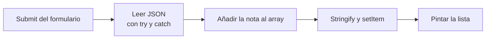

# HTML5

## Unidad 8 · APIs y funcionalidades nativas

**Módulos 0373 (LMH) · 0488 (DI)**

Lenguajes de marcas y sistemas de gestión de información (DAW) · Desarrollo de Interfaces (DAM)

Curso 2026/2027

Note:
Bienvenidos a la unidad de APIs nativas de HTML5. Aquí dejamos de lado las etiquetas y vemos lo que el navegador trae de serie: guardar datos, validar formularios, ubicar, arrastrar, dibujar y pedir datos al servidor. Todas se usan sin instalar nada. Pregunta inicial: ¿sabéis qué sobrevive a un refresco de la página?

---

## Objetivos de aprendizaje

<span class="fragment">1. Leer y escribir <mark>atributos data-*</mark> desde JavaScript con dataset</span>

<span class="fragment">2. Distinguir <mark>cookies, localStorage y sessionStorage</mark> y sus límites</span>

<span class="fragment">3. Personalizar la validación con la <mark>Constraint Validation API</mark></span>

<span class="fragment">4. Emplear geolocalización, arrastre, canvas y fetch <mark>con sus restricciones</mark></span>

Note:
Cuatro objetivos; el segundo y el tercero son los que más se preguntan en el examen porque mezclan teoría y práctica. El cuarto engloba APIs con límites claros: permisos, protocolo seguro y soporte táctil. Recordad que todas conviven con JavaScript, no lo sustituyen.

---

## Motivación · HTML5 no es solo etiquetas

<div style="font-size: 1em; text-align: left;">

Tareas que antes exigían una librería y hoy resuelve el navegador
</div>

<span class="fragment" style="font-size: 1em;">Guardar datos → <mark>cookies, localStorage y sessionStorage</mark></span>

<span class="fragment" style="font-size: 1em;">Validar formularios → <mark>Constraint Validation API</mark></span>

<span class="fragment" style="font-size: 1em;">Ubicar, arrastrar, dibujar y pedir datos → geolocalización, DnD, canvas, fetch</span>

<span class="fragment" style="font-size: 1em;">Todo va <mark>sin instalar nada</mark>: son APIs del navegador, probadas y documentadas</span>

Note:
HTML5 amplió el lenguaje con un conjunto de APIs que resolvían tareas que antes exigían librerías externas. La ventaja es que vienen integradas y sin dependencias; el límite es que son APIs del navegador y no del lenguaje HTML. Esa frontera aparece en el examen como pregunta trampa.

---

## Atributos data-* y dataset

```html
<!-- El estado viaja en el propio elemento, sin clases inventadas -->
<article class="ficha" data-estado="borrador" data-id="42">
  <button class="publicar">Publicar</button>
</article>
<script>
const ficha = document.querySelector('.ficha');
// data-estado → dataset.estado; data-id-unidad → idUnidad en camelCase
console.log(ficha.dataset.estado);   // "borrador"
console.log(ficha.dataset.id);       // "42": SIEMPRE STRING
ficha.querySelector('.publicar').onclick = () =>
  ficha.dataset.estado = 'publicado';   // escribe el atributo
</script>
```

<span class="fragment">Todo atributo que empiece por <code>data-</code> es <mark>válido en HTML5</mark></span>

<span class="fragment">Se lee y se escribe con <code>elemento.dataset</code></span>

<span class="fragment">Usos típicos: <mark>estado, identificador y configuración</mark> de un componente</span>

Note:
El navegador no valida estos atributos, pero los acepta y los expone a JavaScript. Ojo: dataset devuelve siempre texto, nunca números, y convierte los guiones a camelCase. Es el puente limpio entre el marcado y el script sin ensuciar el HTML con atributos a medida.

---

## Cookies y storage

| Almacenamiento | Duración | Viaja al servidor |
|---|---|---|
| Cookies | Caducan | Sí, cada petición |
| localStorage | Hasta borrarla | No |
| sessionStorage | Al cerrar pestaña | No |

<span class="fragment">Las tres guardan <mark>cadenas de texto</mark> por origen</span>

<span class="fragment"><mark>localStorage</mark> no caduca; la de sesión vive en su pestaña</span>

<span class="fragment">Solo las cookies <mark>viajan al servidor</mark>: ~4 KB frente a ~5 MB</span>

Note:
La tabla es la que más se memoriza para el examen. El matiz importante es el alcance: el storage se comparte entre todas las pestañas del mismo origen mientras que sessionStorage es privada de su pestaña. Y un origen es protocolo, dominio y puerto, así que http y https no comparten nada.

---

## Storage con JSON: la regla de oro

```js
// Solo guardan texto: el objeto hay que convertirlo
const perfil = { nombre: 'Marta Ruiz', ciclo: 'DAW', notas: [7, 8, 9] };
localStorage.setItem('perfil', JSON.stringify(perfil));
// Recuperarlo: JSON.parse SIEMPRE dentro de try/catch
try {
  const guardado = JSON.parse(localStorage.getItem('perfil'));
  console.log(guardado.nombre, guardado.notas[0]);
} catch (e) {
  console.warn('No había JSON válido en la clave perfil');
}
// Borrar una clave o el origen entero
localStorage.removeItem('perfil'); localStorage.clear();
```

<span class="fragment"><mark>Escribe con stringify y lee con parse en try</mark>: esa es la regla</span>

<span class="fragment">Guardar el objeto tal cual escribe <code>[object Object]</code> y parse revienta</span>

<span class="fragment">El primer uso llega con la clave vacía: devuelve <mark>un array vacío</mark></span>

Note:
Esta es la regla de oro de la unidad y se aplica a cualquier mini app con persistencia local. JSON.parse lanza SyntaxError cuando la clave no existe o está corrupta, por eso el try. Borrar es tan importante como guardar: clear() elimina todo el origen, no solo tu clave.

---

## Nada de datos sensibles en el cliente

<span class="fragment">Prohibido: <mark>contraseñas, DNI y números de tarjeta</mark> en el storage</span>

<span class="fragment">Es <mark>texto plano</mark> que cualquiera abre en la pestaña Application</span>

<span class="fragment">Un XSS lee y escribe las claves <mark>como si fuera tu propio código</mark></span>

<span class="fragment">Si el dato es secreto, vive en el <mark>servidor</mark> o en una cookie HttpOnly</span>

<span class="fragment">Aquí solo caben cosas <mark>reversibles</mark>: preferencias, borradores, carrito</span>

Note:
Esta es la regla de seguridad de la unidad y no admite excepciones. El almacenamiento del navegador no tiene cifrado ni control de acceso: está a la vista de cualquier script de la página. Guardar ahí la sesión de un usuario equivale a regalarla.

---

## Constraint Validation API

<span class="fragment"><code>form.checkValidity()</code> → <mark>booleano</mark> con todo el formulario</span>

<span class="fragment"><code>input.validity</code> → objeto con el <mark>motivo exacto</mark> del fallo</span>

<span class="fragment">Motivos: <code>valueMissing</code>, <code>patternMismatch</code>, <code>typeMismatch</code></span>

<span class="fragment"><code>setCustomValidity('texto')</code> crea el error; <code>''</code> lo <mark>borra</mark></span>

<span class="fragment"><code>validationMessage</code> es el texto nativo y <code>reportValidity()</code> muestra la burbuja</span>

<span class="fragment">Estados buenos: <code>valid</code>; malos: <code>tooLong</code>, <code>rangeUnderflow</code>, <code>stepMismatch</code></span>

Note:
La validación nativa no termina en los atributos del formulario: JavaScript puede consultarla y personalizarla. El motivo del fallo vive en validity y el mensaje propio se crea y se borra con la misma función. Un error propio que no se resetea deja el formulario inservible para siempre.

---

## Ejemplo: NIF con mensaje propio

```html
<form id="alta" novalidate>
  <label for="nif">NIF</label>
  <input id="nif" name="nif" required pattern="\d{8}[A-Za-z]">
  <p id="error" role="alert"></p>
</form>
<script>
const nif = document.getElementById('nif');
// El navegador no valida un NIF de verdad: aporta tu mensaje
nif.addEventListener('input', () => {
  nif.setCustomValidity(nif.validity.patternMismatch ? '8 dígitos y letra' : '');
});
</script>
```

<span class="fragment"><code>novalidate</code> apaga la burbuja nativa para mostrar <mark>la tuya</mark></span>

<span class="fragment">Equivale a <mark>comprobar el motivo</mark> y escribir el mensaje solo si falla</span>

<span class="fragment"><code>role="alert"</code> hace que el error se <mark>anuncie de inmediato</mark></span>

Note:
El patrón es siempre el mismo: leer validity, decidir el mensaje y resetear con cadena vacía cuando no hay error. novalidate es necesario cuando quieres control total de la interfaz del error. Fijaos en que el formulario sigue aprovechando required y pattern del HTML.

---

## Geolocalización: getCurrentPosition

```js
if (!navigator.geolocation) {
  alert('Tu navegador no soporta geolocalización');
} else {
  navigator.geolocation.getCurrentPosition(
    (pos) => console.log(`${pos.coords.latitude}, ${pos.coords.longitude}`),
    (err) => console.warn(`Error ${err.code}: ${err.message}`),
    { enableHighAccuracy: true, timeout: 8000, maximumAge: 60000 }
  );
}
```

<span class="fragment">El navegador <mark>pregunta</mark>: permitir, bloquear o recordar la decisión</span>

<span class="fragment">Errores: <mark>1 permiso denegado · 2 no disponible · 3 timeout</mark></span>

<span class="fragment"><code>watchPosition</code> solo si necesitas <mark>seguimiento real</mark> de la posición</span>

Note:
Lo primero es comprobar si la API existe, porque en contextos inseguros ni siquiera se define. El segundo argumento de getCurrentPosition es el gestor de errores, y no es opcional en código serio. watchPosition mantiene la posición actualizada pero gasta batería, así que se usa con cabeza.

---

## Permisos, seguridad y privacidad

<span class="fragment">La API <mark>no funciona en http://</mark>: solo en https:// y en localhost</span>

<span class="fragment">Comprueba siempre <code>navigator.geolocation</code> antes de usarla</span>

<span class="fragment">Pídela <mark>en el momento</mark>, nunca en la carga de la página</span>

<span class="fragment">Explica <mark>para qué</mark> la necesitas: «mostrar la distancia al centro»</span>

<span class="fragment">Sin permiso no hay posición: el error 1 llega <mark>antes de cualquier dato</mark></span>

Note:
Este es el error de examen y de práctica más común de la unidad: probar la geolocalización en http:// y creer que está rota. Además del protocolo hace falta el permiso explícito del usuario. Pedirla al cargar sin explicar el motivo es la mejor forma de que la bloqueen para siempre.

---

## Arrastrar y soltar nativo

```html
<ul id="lista">
  <li draggable="true">Lenguajes de marcas</li>
  <li draggable="true">Desarrollo de interfaces</li>
</ul>
<div id="zona">Suelta aquí</div>
<script>
const zona = document.getElementById('zona');
const li = document.querySelector('#lista li');
li.ondragstart = (e) => e.dataTransfer.setData('text/plain', li.textContent); // aquí solo se escribe
zona.ondragover = (e) => e.preventDefault(); // SIN ESTO no hay drop
zona.ondrop = (e) => { e.preventDefault(); zona.textContent = e.dataTransfer.getData('text/plain'); };
</script>
```

<span class="fragment">Orden: <mark>dragstart → drag → dragover → drop → dragend</mark></span>

<span class="fragment"><code>dragover</code> exige <code>preventDefault()</code>: sin él <mark>drop no se dispara</mark></span>

<span class="fragment">No funciona con el dedo → usa <mark>Pointer Events</mark> en táctil</span>

<span class="fragment">Con teclado es imposible: añade botones <mark>subir y bajar</mark></span>

Note:
El arrastre nativo es engañosamente sencillo: la parte difícil es recordar que dragover debe autorizar la zona de suelta. dataTransfer funciona como un portapapeles temporal del arrastre. Y como no hay soporte táctil ni teclado, siempre se ofrece un camino alternativo.

---

## Elementos interactivos nativos: &lt;dialog&gt;

```html
<dialog id="miModal">
  <form method="dialog">
    <h2>Confirmar acción</h2>
    <p>¿Deseas guardar los cambios?</p>
    <button value="cancel">Cancelar</button>
    <button value="confirm" autofocus>Confirmar</button>
  </form>
</dialog>
<button onclick="document.getElementById('miModal').showModal()">Abrir Modal</button>
```

<span class="fragment"><code>showModal()</code> abre en la <mark>Top Layer</mark> con trampa de foco y <code>::backdrop</code></span>

<span class="fragment"><code>show()</code> abre como popup no modal sin bloquear el resto de la página</span>

<span class="fragment"><code>&lt;form method="dialog"&gt;</code> cierra el modal <mark>sin JavaScript</mark> y pasa <code>returnValue</code></span>

Note:
El elemento dialog nativo sustituye librerías enteras de modales y popups. Gestiona automáticamente la trampa de foco, el cierre con tecla Escape, el pseudo-elemento ::backdrop en la capa superior (Top Layer) y el retorno de valor con formularios nativos method="dialog".

--

## Acordeones y plantillas: &lt;details&gt; y &lt;template&gt;

```html
<!-- Acordeón exclusivo nativo con atributo name -->
<details name="faq" open>
  <summary>¿Qué requisitos tiene el curso?</summary>
  <p>Conocimientos básicos de informática y muchas ganas de programar.</p>
</details>
<details name="faq">
  <summary>¿Cómo se evalúa?</summary>
  <p>Mediante proyectos prácticos y pruebas objetivas.</p>
</details>

<!-- Plantilla inerte: no se procesa hasta clonarse -->
<template id="tarjeta-alumno">
  <div class="card">
    <h3 class="nombre"></h3>
    <p class="ciclo"></p>
  </div>
</template>
```

<span class="fragment"><code>&lt;details&gt;</code> / <code>&lt;summary&gt;</code>: colapso/expansión sin JS; con <mark>name="..."</mark> forman acordeones exclusivos</span>

<span class="fragment"><code>&lt;template&gt;</code>: marcado <mark>inerte</mark> clonable con <code>cloneNode(true)</code>, base de Web Components</span>

Note:
El elemento details crea interfaces plegables nativas y accesibles. Con el atributo name moderno, varios details comparten grupo y solo uno permanece abierto al mismo tiempo. El elemento template almacena HTML inerte que no ejecuta scripts ni descarga imágenes hasta ser clonado por JavaScript en el DOM.

---

## Canvas y SVG

<span class="fragment"><code>canvas</code> es un <mark>bitmap</mark>: píxeles que se pixelan al escalar con CSS</span>

<span class="fragment">Su contenido <mark>se pierde al recargar</mark> y no existe sin JavaScript</span>

<span class="fragment">Se dibuja con <code>getContext('2d')</code>: rectángulos, texto y trazados</span>

<span class="fragment">SVG describe el dibujo en <mark>XML</mark>: escala sin pixelarse y se estila con CSS</span>

<span class="fragment">Regla rápida: <mark>bitmap y movimiento → canvas</mark>; iconos nítidos → SVG</span>

Note:
Canvas es ideal para gráficos, juegos y visualizaciones en tiempo real; SVG para iconos, logotipos y gráficos interactivos. La diferencia clave es que el canvas olvida su dibujo mientras que el SVG lo conserva dentro del DOM. Por eso un canvas vacío se queda en blanco si no ejecutas código.

---

## Fetch, Workers e IntersectionObserver

```js
// Fetch: peticiones HTTP dentro de una función async
const r = await fetch('/api/notas.json');
if (!r.ok) throw new Error('HTTP ' + r.status);
const notas = await r.json();
```

<span class="fragment">Fetch sustituye a XMLHttpRequest y devuelve <mark>promesas</mark></span>

<span class="fragment"><mark>Web Workers</mark>: JS en un hilo aparte, sin bloquear la interfaz</span>

<span class="fragment">No tocan el <mark>DOM</mark>: solo intercambian mensajes</span>

<span class="fragment"><mark>IntersectionObserver</mark>: avisa al entrar o salir; base del lazy loading</span>

Note:
Estas tres APIs sí se usan a diario y son las que más se confunden con HTML5. Fetch comprueba el campo ok porque una respuesta 404 también resuelve la promesa. El observer evita escuchar el evento scroll, que resulta muchísimo más costoso.

---

## ¿Qué no es HTML5?

<span class="fragment">«HTML5 es todo el stack moderno» → es el <mark>lenguaje de marcado</mark></span>

<span class="fragment">«localStorage y fetch son HTML5» → son <mark>APIs del navegador</mark></span>

<span class="fragment">«React, Vue o Angular son HTML5» → son <mark>librerías de JavaScript</mark></span>

<span class="fragment">«HTML5 sustituye al backend» → solo cubre el <mark>cliente</mark></span>

<span class="fragment">CSS y JavaScript son especificaciones <mark>aparte</mark> de HTML</span>

Note:
HTML5 es el lenguaje que mantiene el WHATWG y las APIs del navegador conviven con él sin formar parte del lenguaje. Esta diapositiva aparece casi siempre en forma de pregunta de examen. La respuesta corta es que HTML5 no sustituye al servidor ni a la base de datos.

---

## Flujo de la mini app de notas



<span class="fragment">Ciclo completo con <mark>localStorage</mark> y sin dependencias externas</span>

<span class="fragment">Si la clave está vacía o corrupta, <mark>leer devuelve un array vacío</mark></span>

<span class="fragment">Guardar y leer <mark>siempre pasan por JSON</mark>, nunca por texto directo</span>

Note:
Ese bucle es la arquitectura de cualquier mini app con persistencia local: leer, modificar, guardar y volver a pintar. El truco está en la lectura defensiva con try y catch, que absorbe el primer uso con la clave vacía. Añadir borrar y contar ya convierte el ejemplo en una aplicación completa.

---

## Ejemplo práctico · Mini-app con Web Storage y JSON

```html
<form id="form-nota">
  <label for="texto-nota">Nueva nota:</label>
  <input type="text" id="texto-nota" required maxlength="100" placeholder="Estudiar Web Storage...">
  <button type="submit">Guardar nota</button>
</form>
<ul id="lista-notas" aria-live="polite"></ul>
```

```javascript
// Lectura defensiva con parseo seguro de JSON
function leerNotas() {
  try {
    return JSON.parse(localStorage.getItem('notas_daw')) || [];
  } catch (error) {
    console.error('Error leyendo storage:', error);
    return [];
  }
}
// Escritura serializada en cliente (~5 MB)
function guardar(texto) {
  const notas = leerNotas();
  notas.push(texto);
  localStorage.setItem('notas_daw', JSON.stringify(notas));
}
```

<span class="fragment">Almacenamiento síncrono en cliente: pares clave/valor exclusivamente de tipo <code>String</code></span>

<span class="fragment">Serialización obligatoria con <code>JSON.stringify()</code> y deserialización defensiva con <code>try/catch</code></span>

<span class="fragment">Seguridad: mitigación XSS usando <code>textContent</code> al pintar en el DOM, nunca <code>innerHTML</code></span>

Note:
Patrón canónico de persistencia en frontend:
1. Web Storage solo admite texto: si guardas un objeto o array directamente, se convierte en la cadena '[object Object]', corrompiendo la base de datos local.
2. try/catch defensivo: previene que la aplicación crashee si un usuario edita manualmente la clave en DevTools con sintaxis JSON inválida.
3. aria-live="polite" en la lista comunica automáticamente a lectores de pantalla cuando se agrega una nueva nota sin interrumpir el flujo.
4. Regla de seguridad vital: jamás almacenar contraseñas, tokens JWT o datos confidenciales en localStorage, ya que cualquier script XSS puede leerlo con total libertad.

---

## Error común: los fallos que más se corrigen

<span class="fragment">Guardar un objeto <mark>sin JSON.stringify</mark>: sale [object Object]</span>

<span class="fragment">Leer con <code>JSON.parse</code> <mark>fuera de try</mark>: revienta al recargar</span>

<span class="fragment">Probar la geolocalización en <mark>http://</mark> y darla por rota</span>

<span class="fragment">Olvidar <code>preventDefault()</code> en <mark>dragover</mark>: drop jamás se dispara</span>

<span class="fragment">Probar el arrastre con el dedo: la DnD nativa <mark>no va en táctil</mark></span>

Note:
Los dos primeros vienen de no respetar la regla de oro del almacenamiento. El tercero parece un bug del navegador y en realidad es una restricción de contexto seguro. Los dos últimos arruinan cualquier demo de arrastrar y soltar el día del control.

---

## Autoevaluación

<span class="fragment">1. ¿Qué queda escrito al hacer <code>setItem('p', perfil)</code> sin convertirlo?</span>

<span class="fragment">2. ¿Cuánto pesa y cuánto dura <code>localStorage</code> como máximo?</span>

<span class="fragment">3. ¿Por qué no llega nunca el evento <code>drop</code> en tu zona de suelta?</span>

<span class="fragment">4. ¿En qué protocolo no puedes probar <code>getCurrentPosition</code>?</span>

Note:
Cuatro preguntas de las que caen en la teoría y en el práctico. Contestad en el cuaderno antes de bajar con la flecha: las respuestas están en la diapositiva vertical siguiente. La tercera es la que más se olvida el día del control.

--

## Respuestas rápidas

<span class="fragment">1. La cadena <code>[object Object]</code>, inutilizable para <code>JSON.parse</code></span>

<span class="fragment">2. <mark>~5 MB por origen</mark> y de forma <mark>indefinida</mark> hasta que la borres</span>

<span class="fragment">3. Falta <code>preventDefault()</code> en el evento <mark>dragover</mark></span>

<span class="fragment">4. En <code>http://</code>: solo <mark>https:// y localhost</mark>, además con permiso</span>

Note:
Repaso exprés de las cuatro respuestas. La primera y la tercera cuestan puntos porque rompen la funcionalidad completa de la aplicación. Si os falla la segunda, memorizad la tabla del almacenamiento antes del examen.

---

## Claves para el examen

<span class="fragment"><code>data-*</code> es válido y se lee por <mark>dataset</mark>, siempre como texto</span>

<span class="fragment">localStorage <mark>~5 MB indefinido</mark> · sessionStorage cierra pestaña · cookies viajan</span>

<span class="fragment">Storage solo guarda cadenas: <mark>stringify al guardar, parse en try</mark></span>

<span class="fragment">Nada de datos sensibles en el cliente: es <mark>texto plano legible</mark></span>

<span class="fragment">Constraint Validation: <code>validity</code>, <code>checkValidity()</code> y <code>setCustomValidity('')</code></span>

<span class="fragment">Geolocalización con <mark>permiso y HTTPS</mark> · DnD con <mark>dragover + preventDefault</mark></span>

Note:
Seis ideas resumen la unidad entera y cubren storage, validación y geolocalización, los tres bloques con más peso. No olvidéis que fetch, Workers y canvas son APIs del navegador y no parte del lenguaje HTML. Con esto tenéis la unidad cerrada para el examen.
